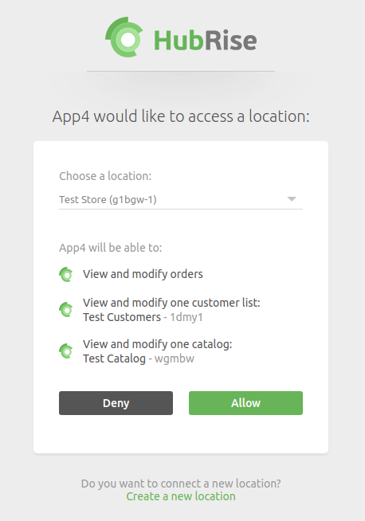

At this stage you will need to contact the App4 support team and request them to complete the steps below. It is not yet possible for users to complete the connection autonomously.

- Login to the App4 back office.
- Click **HubRise Settings**.
- Select the restaurant to connect and click **Enable**.
- Click **Link to HubRise Account**.
- The next steps depend on whether you already have a HubRise location for the restaurant to connect. Refer to the corresponding section below.

### If you already have a HubRise location:

- If you are not logged in, HubRise will prompt for your email and password.
- App4 will then request permission to access your HubRise Location:

- If you have several locations, select the one to connect.
- Click **Allow** to complete the connection with HubRise.

### If don't have a HubRise location yet:

- When the HubRise login page is presented, click **No Account Yet?**.
- You will be prompted to create a new Account and Location. The **Account Name** is your brand name. The **Location Name** identifies the physical store: it should be the city or street where the restaurant is. For more information, see [Create an Account on HubRise](/docs/account/#create-an-account) and [Create a Location on HubRise](/docs/locations/#create-a-location).
- App4 will require permission to access your new HubRise Location. When prompted, click **Allow** to complete the connection.
