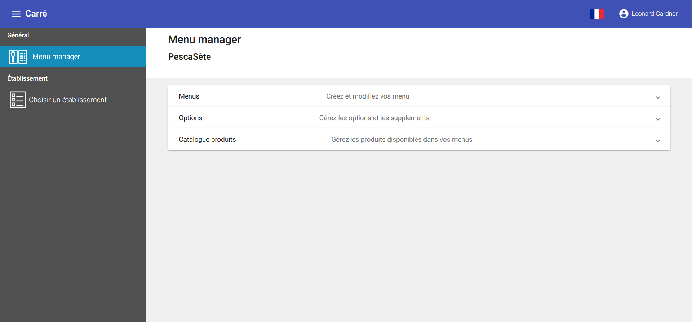
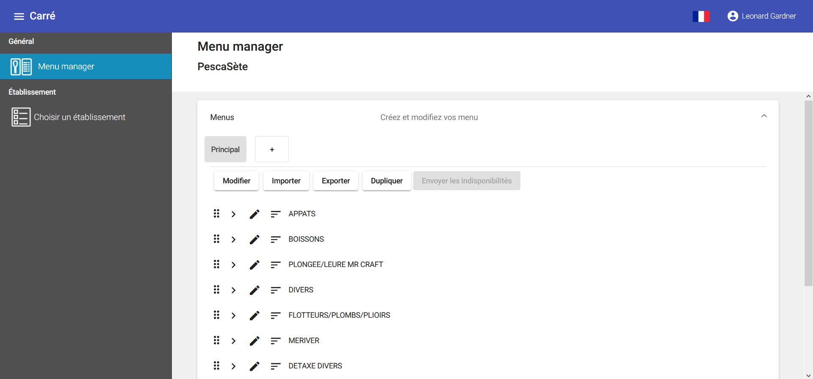
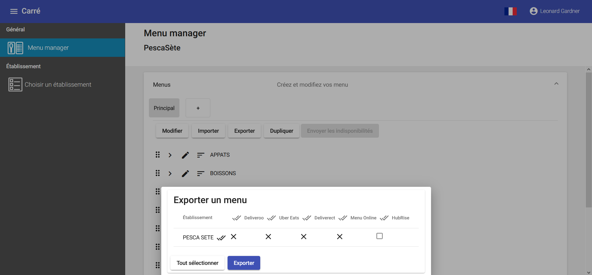
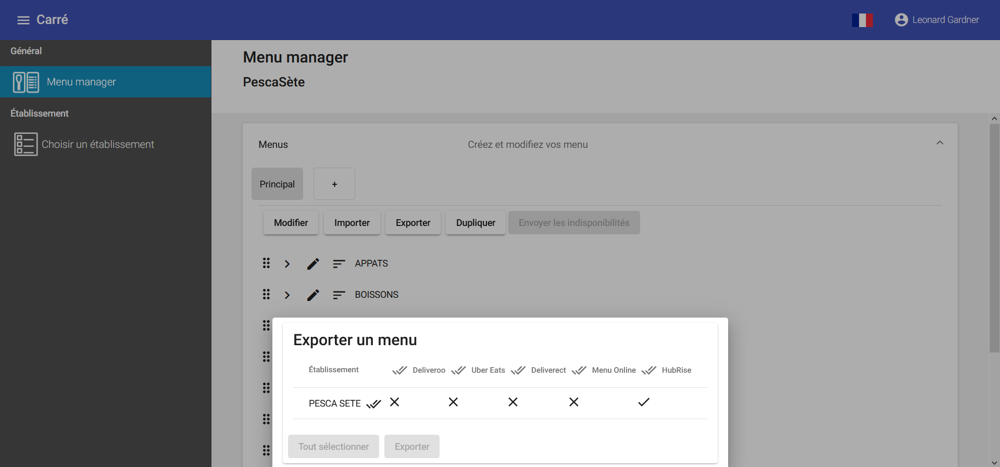
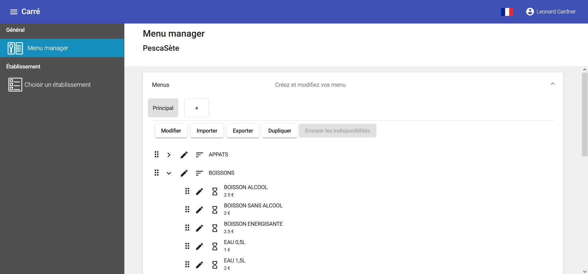
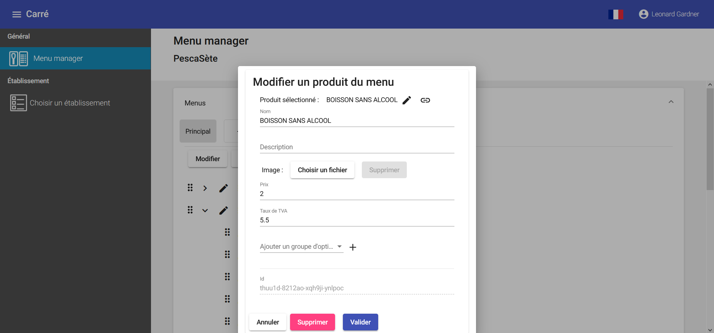
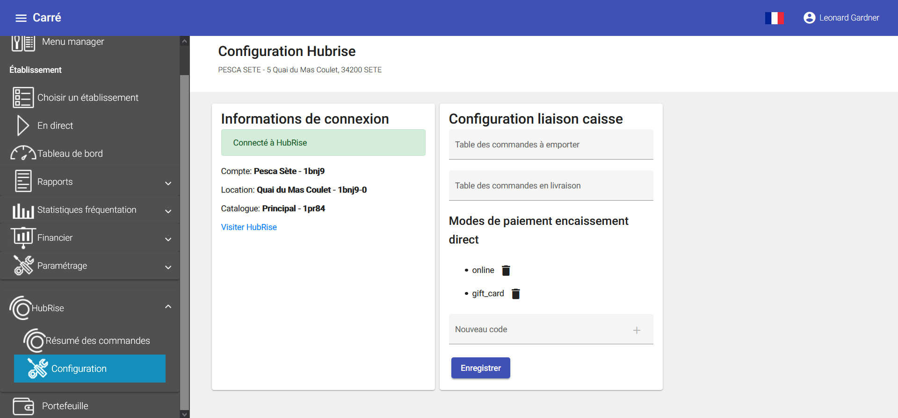

Une fois votre logiciel de caisse Carré POS connecté à HubRise, une dernière étape de configuration est nécessaire. Les différents éléments présents dans Carré POS sont identifiés par des codes ref. Vous devez indiquer ces codes ref dans les applications connectées à HubRise, afin que les commandes puissent être réceptionnées dans Carré POS.

Il y a deux façons de procéder :
- Exporter le catalogue Carré POS vers HubRise, puis importer ce catalogue dans les applications connectées qui le permettent.
- Saisir manuellement les codes ref.

Ces deux méthodes sont parfois complémentaires. Seules certaines applications connectées permettent l'import d'un catalogue depuis HubRise. Pour les autres, il faudra saisir manuellement les codes ref.

Cette page explique comment exporter un catalogue et trouver les codes ref depuis Carré POS. Pour plus d'informations sur l'import d'un catalogue et la saisie des codes ref dans une application connectée, référez-vous à la documentation de l'application sur le site de HubRise.   

## Exporter le catalogue

Pour exporter manuellement le catalogue vers HubRise, suivez les étapes suivantes :

1. Depuis le back-office, dans le menu principal, sélectionnez **Général** > **Menu manager**.
   
1. Déroulez la partie **Menus** et sélectionnez l'onglet correspondant au menu à exporter.
   
1. Cliquez sur **Exporter**.
   
1. Sur la ligne de votre établissement, cochez l'option **HubRise** et cliquez sur **Exporter**.
   

## Produits

Pour retrouver le code ref d'un produit, suivez les étapes suivantes :

1. Depuis le back-office, dans le menu principal, sélectionnez **Général** > **Menu manager**.
   
1. Déroulez la partie **Menus** et sélectionnez l'onglet correspondant au menu contenant le produit désiré.
   
1. Sélectionnez la catégorie à laquelle appartient le produit désiré.
   
1. Cliquez sur le bouton de modification du produit désiré. Le code ref s'affiche dans le champ **Id**.
   

## SKUs

Carré POS ne permet pas de créer de SKU. Pour remplacer cette fonctionnalité, il est nécessaire de créer un nouveau produit pour chaque variante d'un même produit.

## Options

Une option dans HubRise correspond aussi à un produit dans Carré POS. Pour retrouver leur code ref, suivez les mêmes étapes que pour un [produit](/apps/carre-pos/associer-codes-ref#produits).

## Méthodes de paiement

Pour retrouver le code ref d'une méthode de paiement, depuis le back-office, dans le menu principal, sélectionnez **HubRise** > **Configuration**. Dans **Modes de paiement encaissement direct**, la liste des différentes méthodes de paiement s'affiche. Pour chaque élément de cette liste, le libellé correspond à son code ref.
   