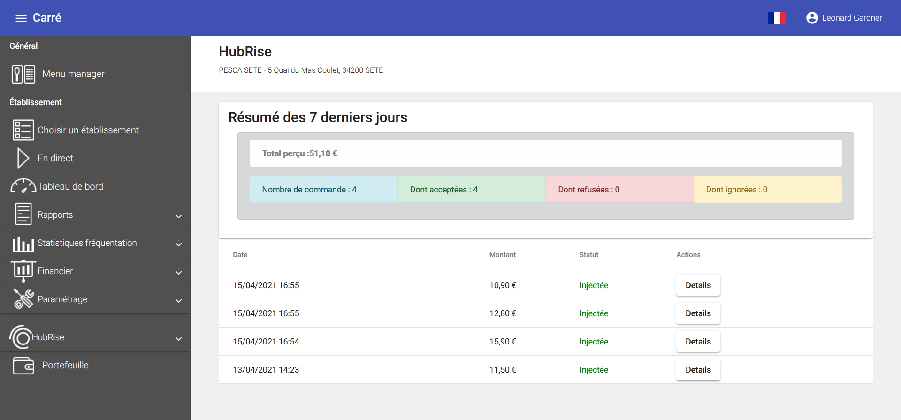
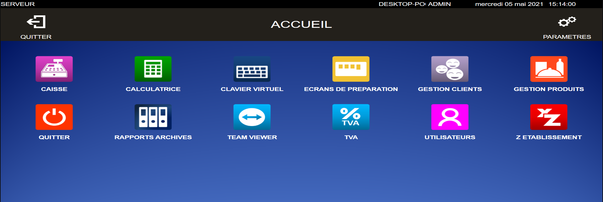
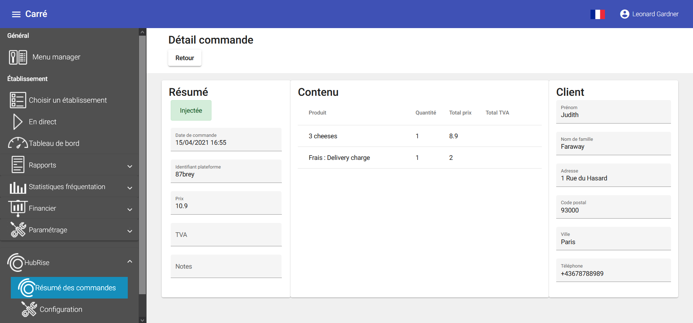

Lorsque Carré POS est connecté à HubRise, les commandes envoyées à HubRise arrivent automatiquement dans votre logiciel de caisse.

## Recevoir des commandes

Pour voir la liste des commandes dans le back-office, dans le menu principal, sélectionnez **HubRise** > **Résumé des commandes**.
   

Pour voir la liste des nouvelles commandes dans le logiciel de caisse, suivez les étapes suivantes :

1. Depuis l'écran de démarrage de Carré POS, cliquez sur **ACCUEIL**.
1. Sélectionnez un utilisateur.
   
1. Cliquez sur **ECRANS DE PREPARATION**.
1. Sélectionnez un écran de cuisine. Les nouvelles commandes reçues sont listées ici.
   

### Commande avec des produits inconnus

Lorsqu'une commande contient des produits dont le code ref n'est pas reconnu, ces derniers sont remplacés par des produits nommés **Divers**. Dans la plupart des cas, l'équipe de Carré POS crée ce produit dans le catalogue du restaurateur lors de l'installation du logiciel. Si ce produit n'a pas été créé, une commande contenant des produits inconnus est rejetée.

### Produits avec des prix différents

Lorsqu'une commande contient des produits dont le prix ne correspond pas à celui de Carré POS, un produit **Frais** ou **Remise** est ajouté à la commande en fonction de la différence de prix. Tout comme le produit **Divers**, l'équipe de Carré POS crée ces produits dans le catalogue du restaurateur lors de l'installation du logiciel.

Par exemple, si une *Margarita Grande* est à 11.00 € dans la commande, mais que son prix est 10.00 € dans le catalogue Carré POS, un produit **Frais** avec un prix de 1.00 € est ajouté à la commande.

### Statut de la commande

Les commandes sont acceptées automatiquement à la réception dans Carré POS.

Carré POS n'envoie pas encore les mises à jour de statut vers HubRise. Cette fonctionnalité est en cours de développement et sera disponible prochainement.

### Détails de la commande

Pour voir les détails d'une commande dans le back-office :

1. Suivez les étapes décrites dans [Recevoir des commandes](/apps/carre-pos/commandes#recevoir-des-commandes) pour accéder à la liste des commandes.
1. Cliquez sur **Details** de la ligne correspondant à la commande.
   

## Envoyer les commandes

Cette fonctionnalité est en cours de développement et sera disponible prochainement.