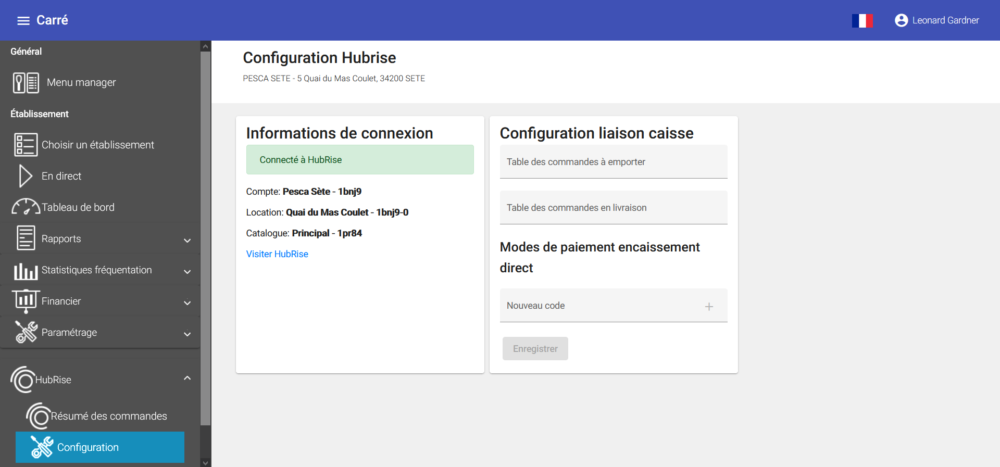

---

**REMARQUE IMPORTANTE :** Pour connecter Carré POS à HubRise, vous devez disposer de la version PRO de Carré POS et être abonné au service Carré POS Cloud.

---

Pour connecter Carré POS à HubRise :

1. Vérifiez que vous disposez de la version PRO de Carré POS et que vous êtes abonné au service Carré POS Cloud. Dans le cas contraire, contactez l'éditeur de Carré POS.
1. Créez un compte HubRise. Pour plus d'informations, consultez notre [Guide de démarrage](/docs/getting-started/).
1. Donnez accès à votre compte à l'équipe support de Carré POS. Pour plus d'informations, voir [Donner accès au support de Carré POS](/apps/carre-pos/connexion-hubrise#donner-acc-s-au-support-de-carr-pos)
1. Contactez l'équipe de support de Carré POS qui se chargera d'établir la connexion à HubRise, en leur précisant l'identifiant HubRise et le nom du point de vente à connecter.

## Vérifier le statut de la connexion

Vous pouvez à tout moment vérifier le statut de votre connexion à HubRise depuis le logiciel Carré POS:

1. Ouvrez le menu principal de Carré POS.
1. Sélectionnez **HubRise** > **Configuration**.

Si votre logiciel est connecté à HubRise, le nom et l'identifiant du point de vente et du catalogue HubRise connectés à votre logiciel apparaissent dans la partie **Informations de connexion**.

## Donner accès au support de Carré POS

Pour connecter Carré POS, et faciliter la prise en charge de vos demandes de support, nous vous recommandons de donner accès à votre compte HubRise à l'éditeur de la solution Carré POS.

Pour donner accès à Carré POS, procédez comme suit :

1. Depuis le back-office de HubRise, sélectionnez **CONFIGURATION** dans le menu de gauche.
1. Dans la section **Permissions**, ajoutez hubrise@carrepos.fr en sélectionnant l'option **Manager** dans la liste déroulante des rôles.
1. Cliquez sur l'icône **+** pour ajouter le nouvel utilisateur.
