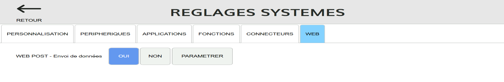
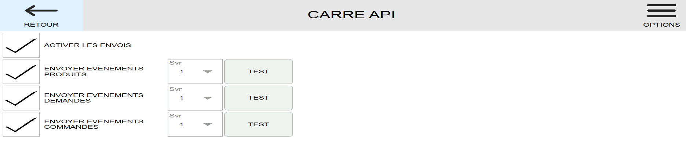
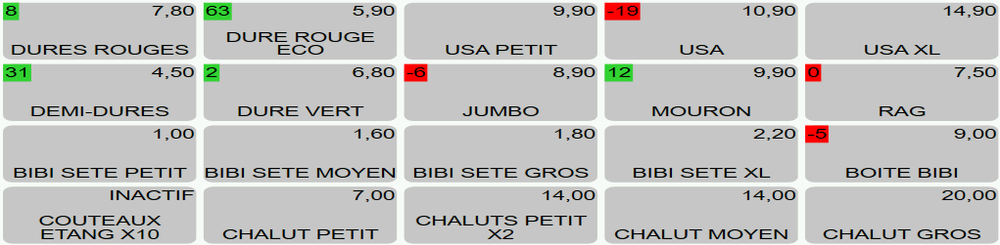

Carré POS peut envoyer l'inventaire et l'indisponibilité des produits vers HubRise. Cette fonctionnalité doit être activée dans les réglages de Carré POS.

## Activer l'envoi de l'inventaire vers HubRise

Pour activer l'envoi automatique de l'inventaire et de l'indisponibilité des produits vers HubRise, suivez les étapes suivantes :

1. Ouvrez Carré POS.
1. Cliquez sur **ACCUEIL**.
1. Choisissez l'utilisateur **ADMIN** ou un utilisateur ayant les droits d'administration.
1. Sélectionnez **Paramètres** > **Réglages**, puis ouvrez l'onglet **WEB**.
1. Vérifiez que le réglage **WEB POST - Envoi de données** est sur **OUI**.
   
1. Cliquez sur **PARAMETRER**, puis sélectionnez l'onglet **CARRE API**, et cliquez sur **PARAMETRER**.
1. Cochez les cases **ACTIVER LES ENVOIS** et **ENVOYER EVENEMENTS COMMANDES**.
   
1. Redémarrez Carré POS.

Après le redémarrage de Carré POS, l'inventaire et l'indisponibilité des produits devraient être transmis à HubRise automatiquement.

## Envoi manuel de l'inventaire

Bien que l'inventaire soit synchronisé automatiquement, vous pouvez également l'envoyer manuellement depuis le back-office de Carré POS :

1. Ouvrez le back-office Carré POS.
1. Sélectionnez **HubRise** > **Configuration**.
1. Cliquez sur **Synchroniser les stocks**.

Cette fonction peut s'avérer utile notamment en cas de nouvelle connexion à HubRise ou de problème de synchronisation identifié.

## Stock et indisponibilité des produits

Pour une consultation rapide, vous pouvez voir l'inventaire et l'indisponibilité des produits directement dans l'écran de caisse :

- Les nombres apparaissant en vert indiquent la quantité disponible en stock.
- Les nombres apparaissant en rouge indiquent un stock épuisé.
- La mention **INACTIF** indique que le produit est indisponible.

D'autres interfaces sont disponibles pour la gestion du stock et de la disponibilité des produits, mais elles sont hors du périmètre de cette documentation.

## Synchronisation avec HubRise

Carré POS envoie automatiquement l'inventaire et l'indisponibilité des produits vers HubRise à chaque modification :

- Si le produit est indisponible, le stock est mis à `0` sur HubRise.
- Sinon, si la gestion de stock est activée pour le produit, le stock est mis à la quantité disponible.
- Sinon, le stock n'est pas envoyé à HubRise.
