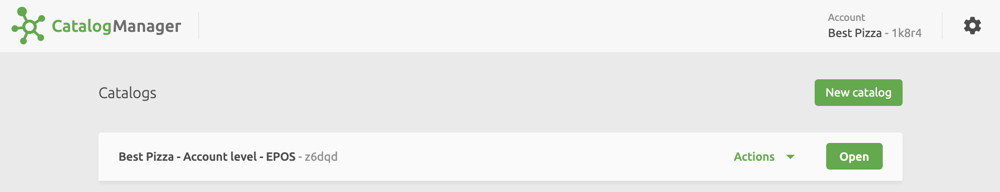
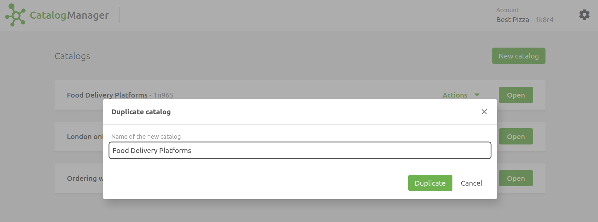

A **Catalog** is a container for your products and their associated details. Catalogs are stored in HubRise and managed using Catalog Manager.

Catalogs can be created globally across all locations, or at a specific location level. For more information, refer to the HubRise Help pages [Accounts](/docs/account) and [Locations](/docs/locations).

In one location, you may, for example, create a catalog to import products from your EPOS and synchronise them with your online ordering solution. In another location, you may create a catalog which is manually maintained and is used only to populate your online menu. You can also have multiple catalogs in the same location.

## Open the Catalogs Page

The **Catalogs** page is the default page of Catalog Manager. It opens when you launch Catalog Manager. At any time, you can return to this page by clicking the logo in the top-left corner of the screen.

## Create a Catalog

To create a catalog in Catalog Manager, open the **Catalogs** page, click **New catalog** and enter a name. After you create the new catalog, you can add categories, products, options, deals, discounts and charges directly in Catalog Manager.

Alternatively, you can create a catalog from the **SETTINGS** page in your HubRise back office. For more information, refer to the HubRise Help page [Add a Catalog](/docs/catalog#add).

## Catalog Actions

You can **Rename**, **Duplicate** an existing catalog, or **Delete** existing catalogs using the Catalog Manager **Actions** dropdown.

## Duplicate a Catalog {#duplicate}

Duplicating a catalog can be useful if you want to create a new catalog based on an existing one, or to make a backup of your catalog.

To duplicate a catalog, follow these steps:

1. In Catalog Manager, go to the **Catalogs** page.
1. Find the catalog you want to duplicate, expand the **Actions** list, then select **Duplicate**.
1. Provide a name for the new catalog, then click **Duplicate**.

Use clearly identifiable names for your catalogs. For example, if you create a catalog for Uber Eats, you could name it **Uber Eats**. If you create a backup catalog, include **Backup** or **Do not edit!** in the name, to make it clear that it should not be edited.
