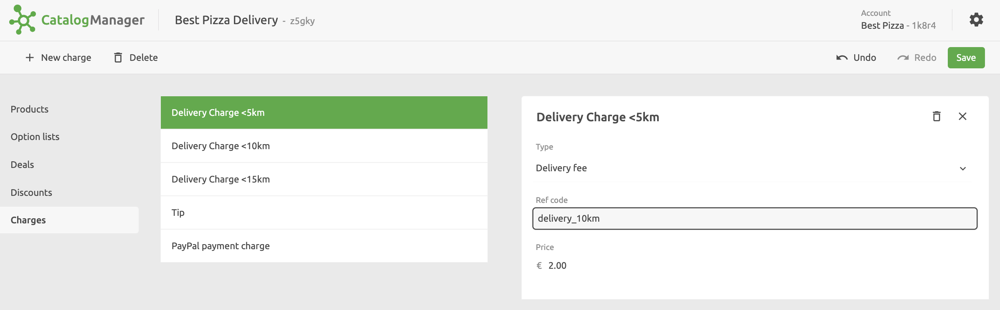

Charges are flat fees that you can apply to a total purchase, such as delivery fees, tips or other costs.

## Which Apps Support Charges?

Most apps do not support charges, as they typically manage charges directly in their back office. To check if a certain app supports charges, see the app's documentation on the HubRise website.

---

**IMPORTANT NOTE:** Charges are not exported to food delivery platforms, they are managed directly in the platform's back office.

---

## Create Charges

To create a charge, click on **Charges** > **New charge** and enter a name. After the charge is created, you can add the details.
