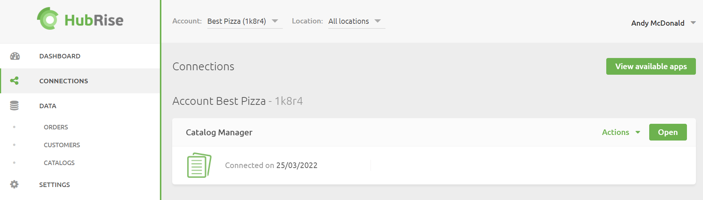

A **Catalog** is simply a container for your products and their associated details. There are 3 ways you can create a catalog:

- From an EPOS
- From an Online Ordering System or Food Ordering Platform
- Using Catalog Manager

## Create a Catalog from Another App

Some EPOS solutions allow you to push your product catalog or menu into a HubRise catalog. Same for some online ordering solutions or food ordering and delivery platforms. You can then use Catalog Manager to augment the details for your product items by adding photos or more detailed descriptions.

For information on how to export your product catalog or menu into a HubRise catalog, refer to your EPOS or other app documentation on the HubRise website.

---

**IMPORTANT NOTE:** Exporting a menu from your EPOS into a HubRise catalog will replace all the items in the existing catalog.

---

## Create a Catalog using Catalog Manager

Go to **Connections** and click on **Open** in Catalog Manager.

In Catalog Manager, click on **New catalog** and enter a name.

Once the new catalog has been created you can add products, options, deals, discounts and charges.
