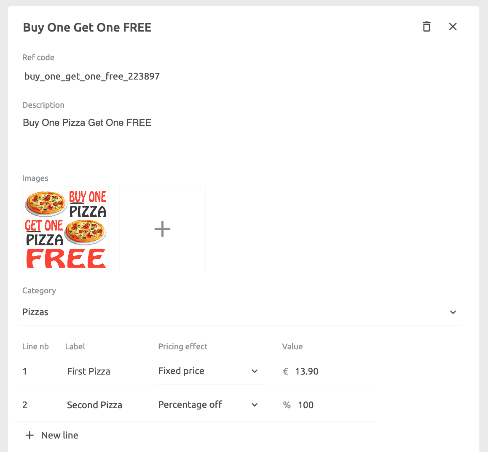

## Deals

To create a deal, click on **Deals** > **New deal** and enter a name. Once the deal is created, you can add the details and relate it to one or more products.

1. Enter a **Ref code** by typing directly in the ref code text box.
2. Enter a **Description** by typing directly in the description text box.
3. Add one or more **Images** of the deal by clicking on the **+** icon.
4. Select a **Category** to which this deal belongs and within which it will be displayed online.
5. Enter the details of the deal. This will vary for each deal. Within a Deal, products can have a **Fixed price**, a **Percentage off**, a **Price off**, and keep its price **Unchanged**.
6. Select the products you want this deal to be related to by selecting **Attach SKss**. You need to specify products that are related to each line of the deal. Certain items can be associated an additional cost.

As an example, for a `Buy One Get One FREE` deal, you would enter one line item to represent the `Buy One` part of the deal. This will be set at its normal price by selecting **Unchanged**. You would then add a second line item to represent the `Get One FREE` part of the deal. Here you would enter a percentage off pricing effect of `100%`. You can limit the choice of free item to only certain products by selecting them with the **Attach SKUs** feature in the **Deal lines** section.

Another example would be a `Three-course meal for £20`. You will need three lines, one for the `Appetiser`, another for the `Main dish`, and the last one for the `Dessert`. The first item would be set to a `£20` **Fixed price**. The two others would be set to `£0`. The choice of items available for each of the lines can be selected in the **Deal lines** section thanks to the **Attach SKUs** feature.

## Discounts

Discounts are simple percentage or amount discounts that can be applied on a total purchase, as opposed to a specific product item.

To create a discount, click on **Discounts** > **New discount** and enter a name. Once the discount is created, you can add the details.

## Charges

Charges are flat fees that you can apply to a total purchase for things like delivery, fees, tips or other costs.

To create a charge, click on **Charges** > **New charge** and enter a name. Once the charge is created, you can add the details.
