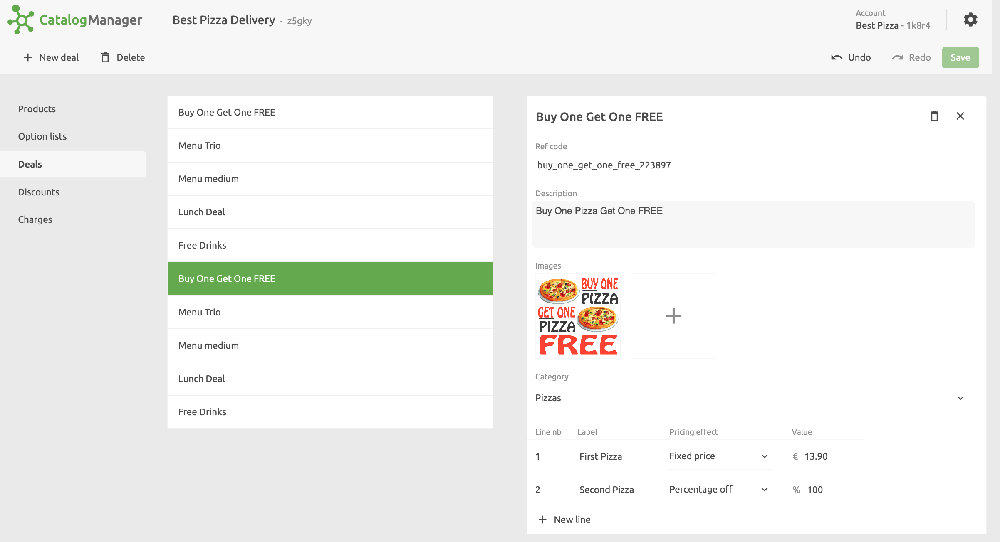
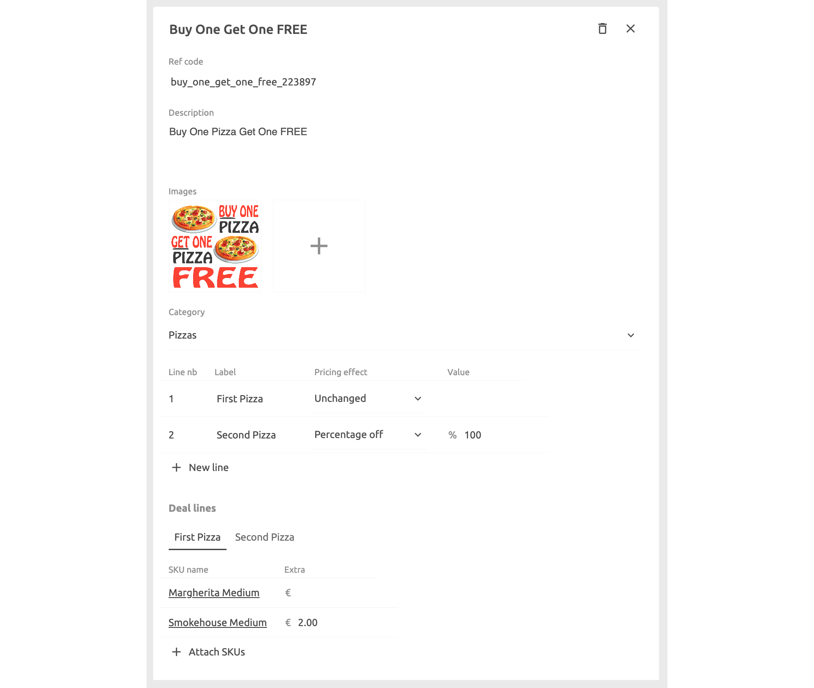

Deals are special offers that you can configure for your menu. There are several ways that you can set deals up to meet your specific requirements. This includes offering percentage or absolute discounts and limiting the deal to certain products. A typical example could be a `Buy One Get One FREE` deal.

## Create Deals

To create a deal, click on **Deals** > **New deal** and enter a name. After you create the deal, you can add the details and relate it to one or more products.

1. Enter a **Ref code** by typing directly in the ref code text box.
1. Enter a **Description** by typing directly in the description text box.
1. Add one or more **Images** of the deal by clicking on the **+** icon.
1. Select a **Category** to which this deal belongs and within which it will be displayed online.
1. Specify the deal lines for your deal. Deal lines specify groups of products that customers can choose from, and the pricing rule applied to this group, for example **Fixed price**, **Percentage off**, **Price off**, and price **Unchanged**.
1. For each deal line, select the products that you want to include by clicking **Attach SKUs**. For any item, you can include an additional price under the **Extra** column, which will be added to the price determined by the item's pricing rule.

## Deals Examples

### Buy One Get One Free

To set up a `Buy One Get One FREE` deal, create one line item to represent the `Buy One` part of the deal. This will be set at its normal price by selecting **Unchanged**. Then add a second line item to represent the `Get One FREE` part of the deal. Enter a percentage off pricing effect of `100%` for this line item. For each line item, choose the allowed products by selecting **Attach SKUs** in the **Deal lines** section.

### Fixed Price

To set up a `Three-course meal for £20`, you will need three lines, for example one for the `Appetiser`, another for the `Main dish`, and the last one for the `Dessert`.

The first item would be set to a `£20` **Fixed price**. The two others would be set to `£0`. The choice of items available for each of the lines can be selected in the **Deal lines** section thanks to the **Attach SKUs** feature.
