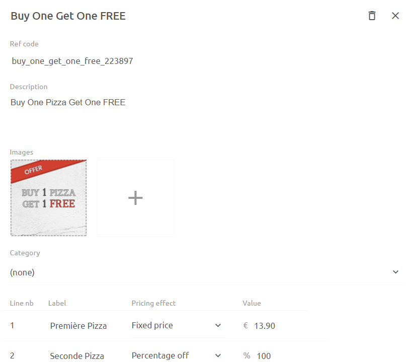

## Create or Edit a Deal

To create a deal, click on **Deals** > **New deal** and enter a name.  Once the deal is created, you can add the details and relate it to one or more products.

1. Enter a **Ref code** by typing directly in the ref code text box.
2. Enter a **Description** by typing directly in the description text box.
3. Add one or more **Images** of the deal by clicking on the **+** icon.
4. Select a **Category** to which this deal belongs
5. Enter the details of the deal. This will vary for each deal. As an example, for a `Buy One Get One FREE` deal, you would enter one line item to represent the `Buy One` part of the deal - this will be set at its normal price by selecting **Unchanged**.  You would then add a second line item to represent the `Get One FREE` part of the deal - here you would enter a percentage off pricing effect of **100%**.
6. Select the products you want this deal to be related to in the **SKU name** section. You need to specify the SKUs that are related to _each part_ of the deal.  For example, in the `Buy One Get One FREE` deal, you can limit the choice of free item to only certain products.

## Create or Edit a Discount

Discounts are simple percentage or amount discounts that can be applied on a total purchase, as opposed to a specific product item.

To create a discount, click on **Discounts** > **New discount** and enter a name.  Once the discount is created, you can add the details.

## Create or Edit a Charge

Charges are flat fees that you can apply to a total purchase for things like delivery, fees, tips or other costs.

To create a charge, click on **Charges** > **New charge** and enter a name.  Once the charge is created, you can add the details.
