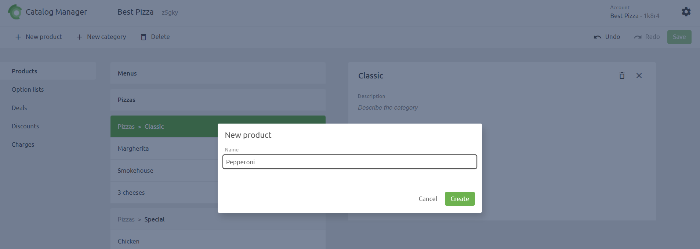
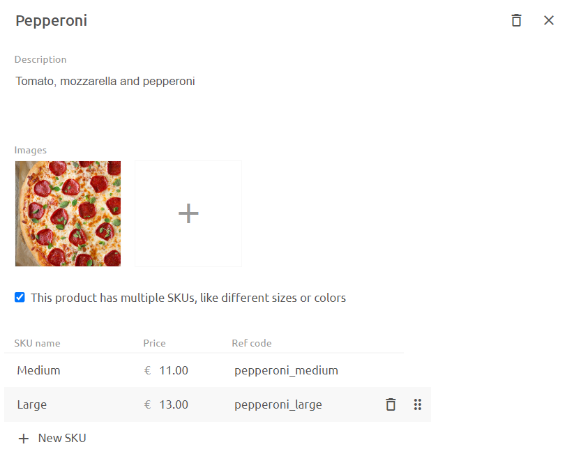
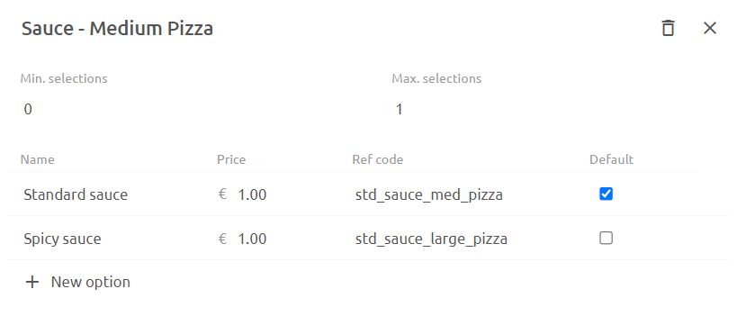
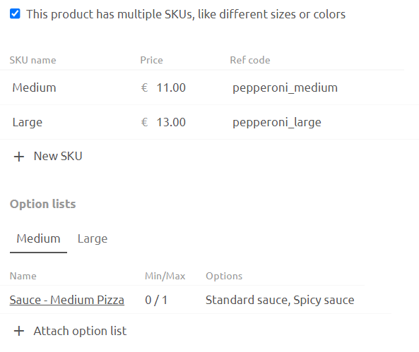
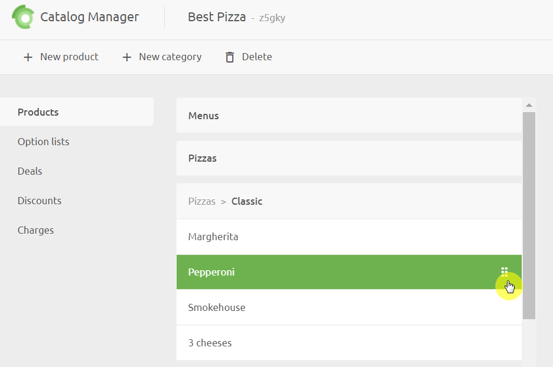

A **Catalog** contains products, deals, discounts and charges.  The product items themselves contain details about the products, including variations and optional extras.  Managing this information in a central place is one of the key objectives of Catalog Manager.

## Create a Product

To create a product, select the category where the product should be located, click on **New product** and enter a descriptive name for the product.

Once you've created the new product, you can add details to it and relate it to optional items and deals.  You can also move the product to a different category by dragging and dropping with the drag handles on the right-hand side of the product entry.

### Add or Edit Product Details

- In the **Description** field enter the product description.
- Add one or more **Photos** of the product by clicking on the **Add** icon.  For Food Ordering and Delivery platforms, we recommend that images should be jpg or png, 1920x1080 pixels, with a ratio of 16:9.
- If the product has variations that a customer needs to choose from, tick the **multiple SKU** check box.  You will then need to enter the SKU, **Price** and **Ref code** for each variation.  If there are no variations, then you can enter the price and ref code.

### Add or Edit Option Lists

Option Lists can be added to the base product, if there are no variations, or to each variation when these are present. 

The Options List needs to be created before you can relate them to a product item. To create an Options List, click on **Options Lists** > **New option** list.  The following information is required:

- Name
- Minimum number a customer can select.
- Maximum number a customer can select.
- For each option, enter a name, price, Ref code and default flag.

Keep in mind that and Options Lists are related to specific products, or product variations, so it is useful to name your Options List appropriately.  For example, for a medium pizza variation you may have 2 sauce options which you would include in an Options List called `Sauce - Medium Pizza`.

Once you have created one or more Option Lists, you can add them to your products:

1. Select the tab for the variation that you want to add options to, then click **Attach Option List**.  You can now select from any previously added Option Lists
2. For each of the product variations, lick **Attach Option List** and select the appropriate Options List.

## Delete a Product

To delete a product, select it from the product list and click on the **Delete** icon in the product details pane.

## Rearrange Products

The order in which products are displayed in the catalog list can be changed by dragging products and category headings using the drag handles on the right of the product block.

