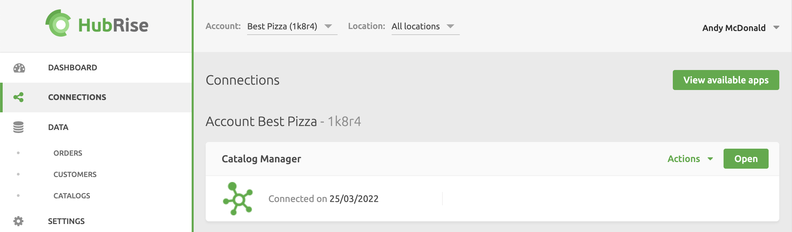

To open Catalog Manager, follow these steps:

- Log in to [HubRise](https://manager.hubrise.com)
- Select **CONNECTIONS**
- Click **Open** next to the Catalog Manager app. Catalog Manager will open in a new browser tab.

To close Catalog Manager, simply close the browser tab. This will terminate your session.

Catalog Manager is tested and supported on all major browsers, however we recommend using Google Chrome on a desktop or laptop computer for the best experience
