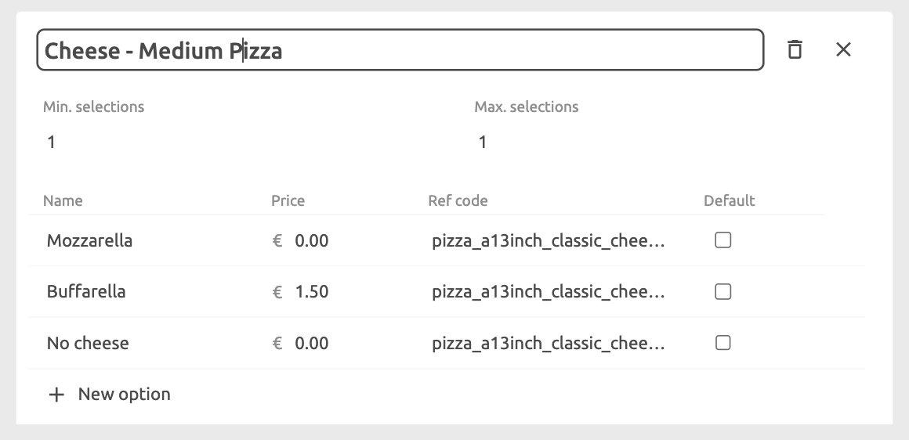
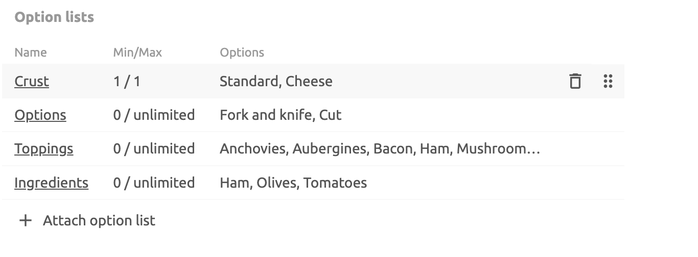

Options are additional items which customers can add to a product when ordering.

When you create a product, you can choose to create a relationship between the product and an option list. The option list needs to be created before you can relate it to a product item. Option lists might differ from one product variation to another; for example, additional toppings on a medium pizza could be cheaper than those offered on a large pizza.

When viewing option lists, you can see the number of SKUs or products that the option list is used in. This helps you track of which options are used in which products.

## Create Option Lists

Option lists can be added to the base product, if there are no variations, or to each variation when these are present.

Option lists need to be created before they can be related to product items. To create an option list, click **Option lists** on the left hand side menu panel, then select **New option list**. The following information is required:

- Name
- Minimum number of options a customer can select. Defaults to `0`.
- Maximum number of options a customer can select. Defaults to empty, which means that there is no limit.
- For each option, enter a **Name**, **Price**, **Ref code**, and tick the **Default** checkbox if the option should be selected by default.

Keep in mind that option lists are related to specific products, or product variations, so it is useful to name your option list appropriately. For example, for a medium pizza variation you may have three cheese options which you would include in an option list called `Cheese - Medium Pizza`.

After you have created one or more option lists, you can add them to your products:

1. Select the tab for the variation that you want to add options to, for example `10inch Classic`, then click **Attach option list**. You can now select from any previously added option lists.
1. For each of the product variations, click **Attach option list** and select the appropriate option list.

## Delete an Option List

To delete an option list, select it from the list and click the delete icon in the option list details pane. Deleting an option list automatically removes it from any products it is related to.

## Rearrange Option Lists

To change the order in which option lists are displayed in the catalog, drag the option list using the drag handles on the right of the option list block. This
does not affect how option lists are displayed in a product, but it can be useful for organising your option lists.

To change the order in which option lists are displayed in a product, go to **Products**, select the product where you want to edit the order, then drag the option list using the drag handles on the right of the list. The order in which option lists are displayed in a product is maintained in the apps you push the catalog into.

