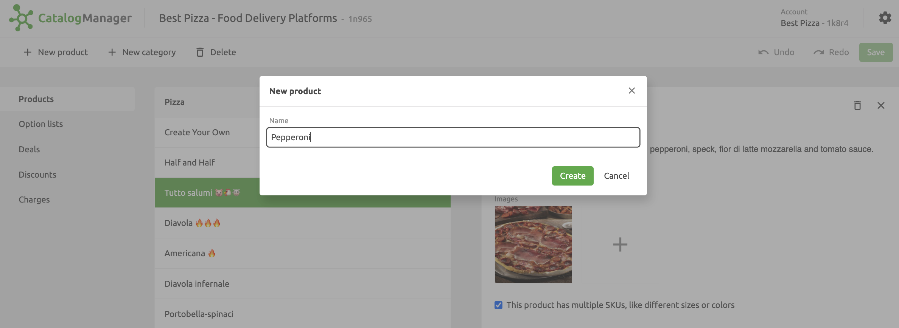
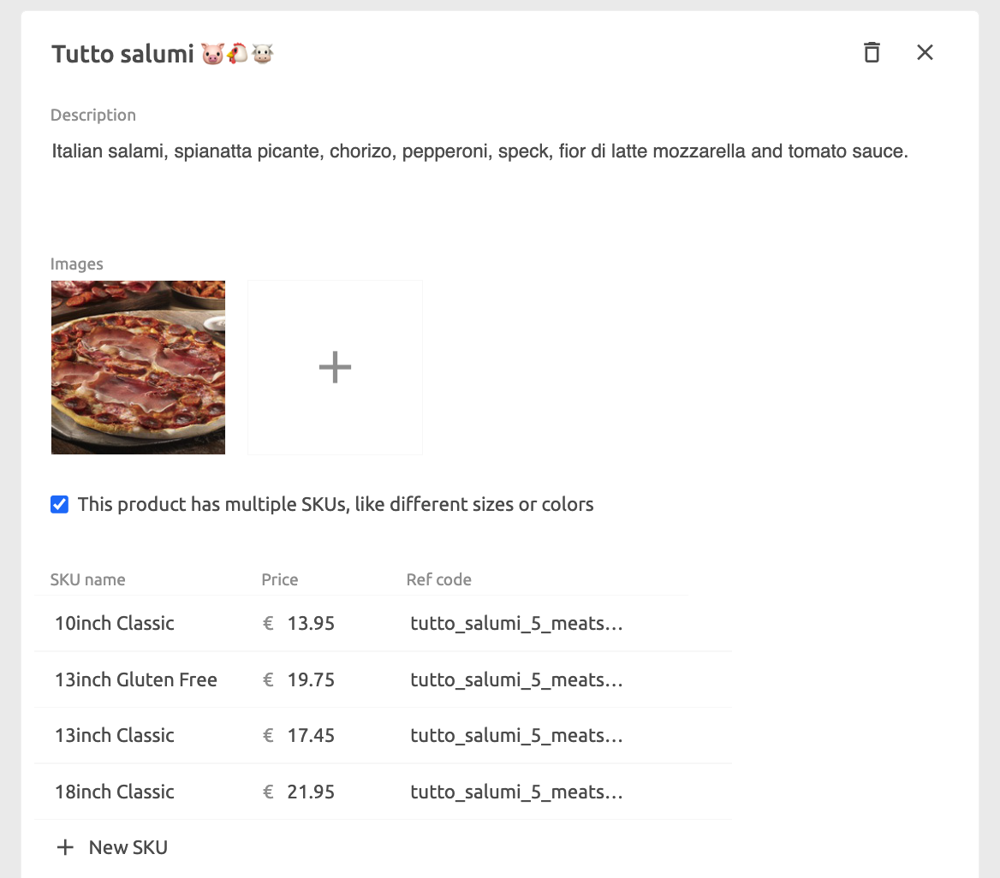
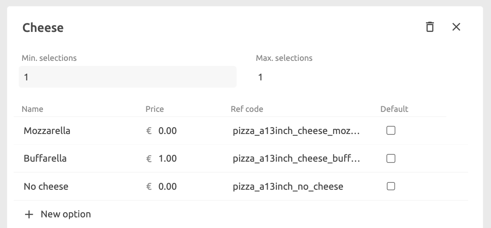
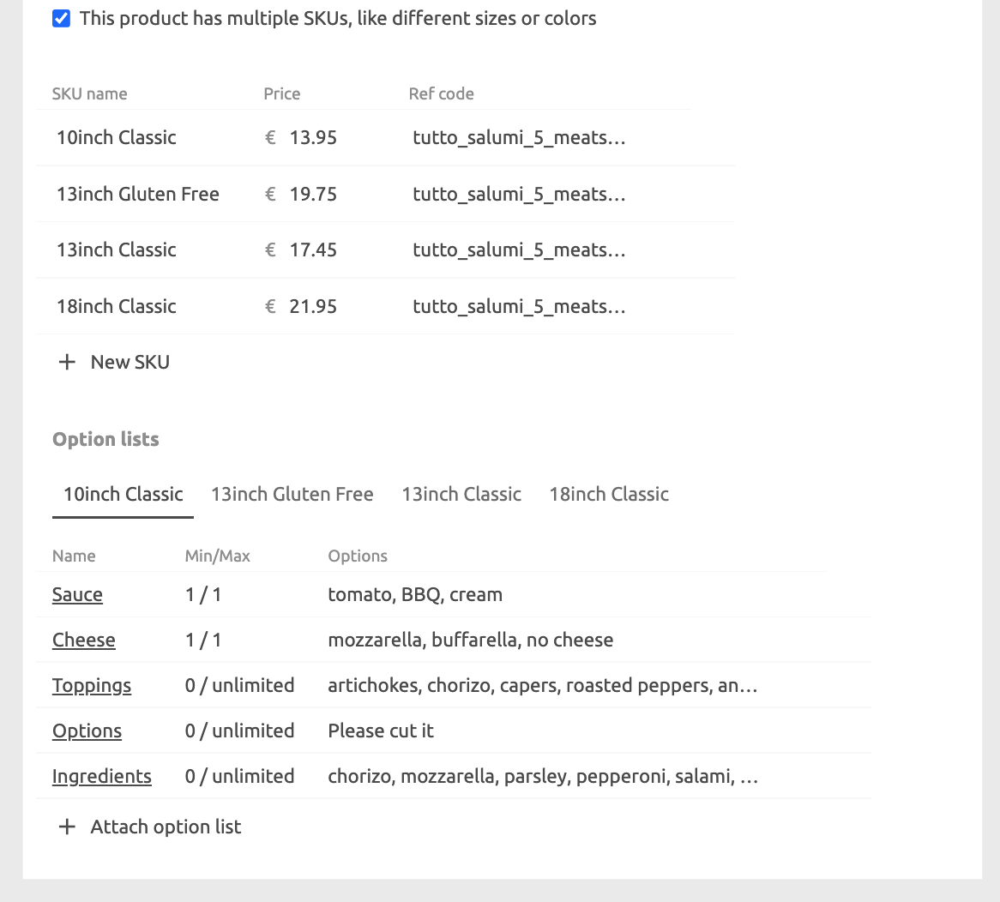
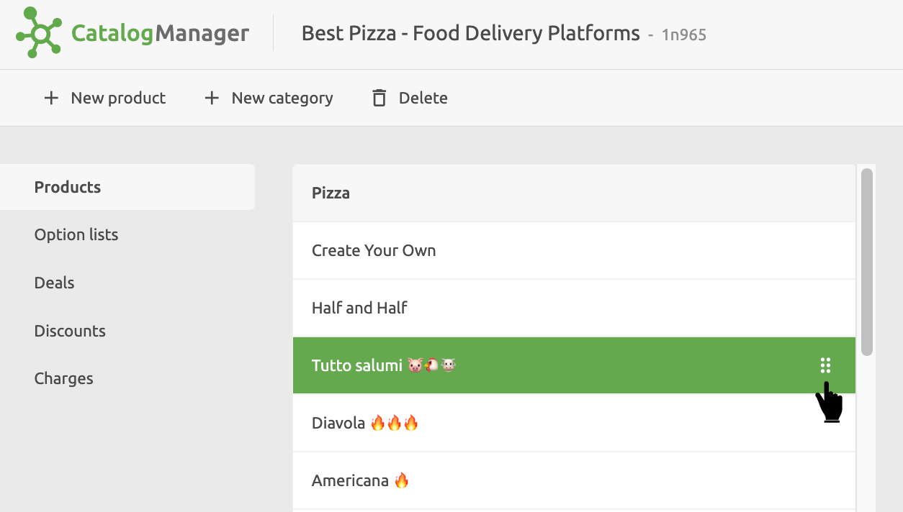

## Create a Product

To create a product, select the category where the product should be located, click on **New product** and enter a descriptive name for the product.

Once you've created the new product, you can add details to it and relate it to optional items and deals. You can also move the product to a different category by dragging and dropping with the drag handles on the right-hand side of the product entry.

## Add or Edit Product Details

- In the **Description** field enter the product description.
- Add one or more photos of the product by clicking on the **+** icon. For food ordering and delivery platforms, we recommend that images should be jpg or png, 1200x800 pixels or larger, with a ratio of 16:9.
- If the product has variations that a customer needs to choose from, tick the **multiple SKUs** check box. You will then need to enter the **SKU Name**, **Price** and **Ref code** for each variation. If there are no variations, then you can enter the price and ref code.
- You can include more variations by selecting **+ New SKU**.

## Manage Option Lists

Option Lists can be added to the base product, if there are no variations, or to each variation when these are present.

The Options List needs to be created before you can relate them to a product item. To create an Options List, click on **Options Lists** in the left hand side menu panel, then select **New option list**. The following information is required:

- Name
- Minimum number a customer can select the option.
- Maximum number a customer can select the option.
- For each option, enter a **Name**, **Price**, **Ref code** and flag the **Default** option.

Keep in mind that and Options Lists are related to specific products, or product variations, so it is useful to name your Options List appropriately. For example, for a medium pizza variation you may have three cheese options which you would include in an Options List called `Cheese - Medium Pizza`.

Once you have created one or more Option Lists, you can add them to your products:

1. Select the tab for the variation that you want to add options to, for example `10inch Classic`, then click **Attach option list**. You can now select from any previously added Option Lists.
1. For each of the product variations, click **Attach option list** and select the appropriate Options List.

## Delete a Product

To delete a product, select it from the product list and click on the delete icon <InlineImage width="20" height="20"></InlineImage> in the product details pane.

## Rearrange Products

The order in which products are displayed in the catalog list can be changed by dragging products and category headings using the drag handles <InlineImage width="20" height="20"></InlineImage> on the right of the product block.

