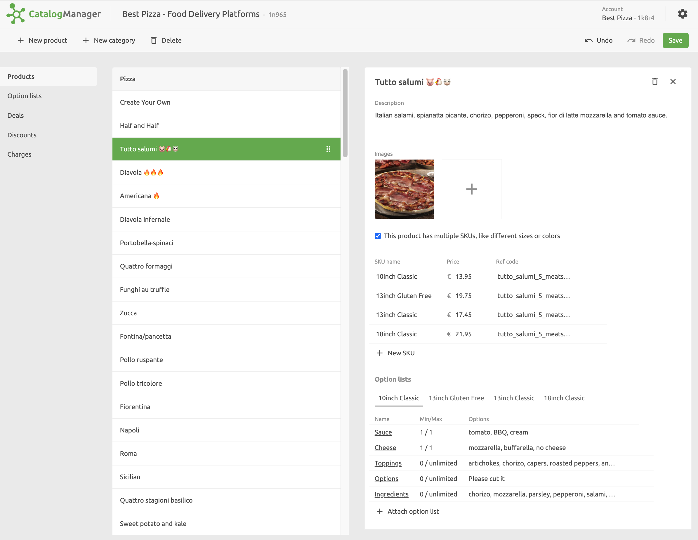
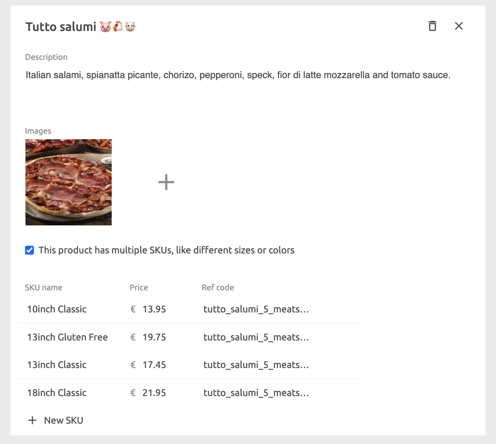
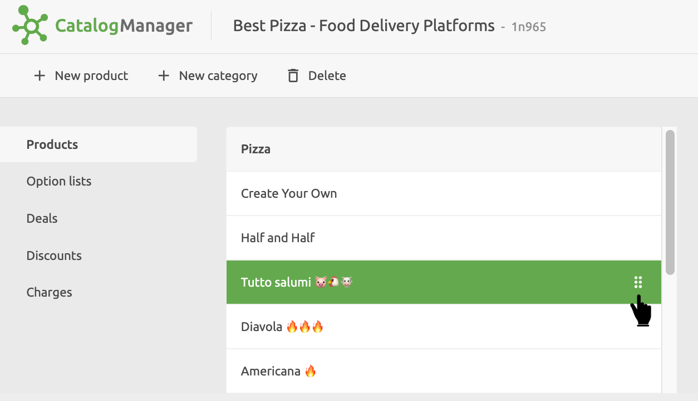

When you open a Catalog, the **Products** page in the **Edit** view is displayed.
This lists all your products grouped by category. To add a new category, click **New category** and enter a name.

For each product, in the product's details pane you can view and edit the following:

- Product name
- Description
- Images
- Variations, referred to as **SKUs**
- Option Lists

Variations are typically used to provide different versions of the base product, such as sizes or colours. Options allow you to specify optional additional items, such as extras.

---

**IMPORTANT NOTE:** Each variation has its own ref code and price which must be entered if you are connecting an EPOS. If a product has no variations, then the ref code for the base product needs to be entered.

---

## Create a Product {#create}

To create a product, select the category or the product immediately above where the product should be located, click **New product** and enter a descriptive name for the product.

After you have created the new product, you can add details to it and relate it to optional items and deals.

## Add or Edit Product Details

- In the **Description** field enter the product description.
- Add one or more photos of the product by clicking on the **+** icon. For food ordering and delivery platforms, we recommend that images should be jpg or png, 1200x800 pixels or larger, with a ratio of 16:9.
- If the product has variations that a customer needs to choose from, select the **multiple SKUs** check box.
  Then, for each variation enter the **SKU Name**, **Price** and **Ref code**.
  If there are no variations, then enter the price and ref code for the product.
- You can include more variations by selecting **+ New SKU**.

## Delete a Product

To delete a product, select it from the product list and click on the delete icon in the product details pane.

## Rearrange Products

You can rearrange the order of the items by using the drag handle on the right-hand side of the product entry.

The order in which products are displayed in the Catalog Manager is maintained in the apps you push the catalog into.
