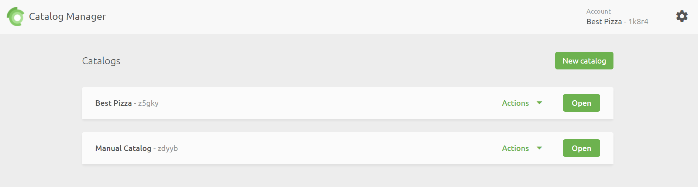
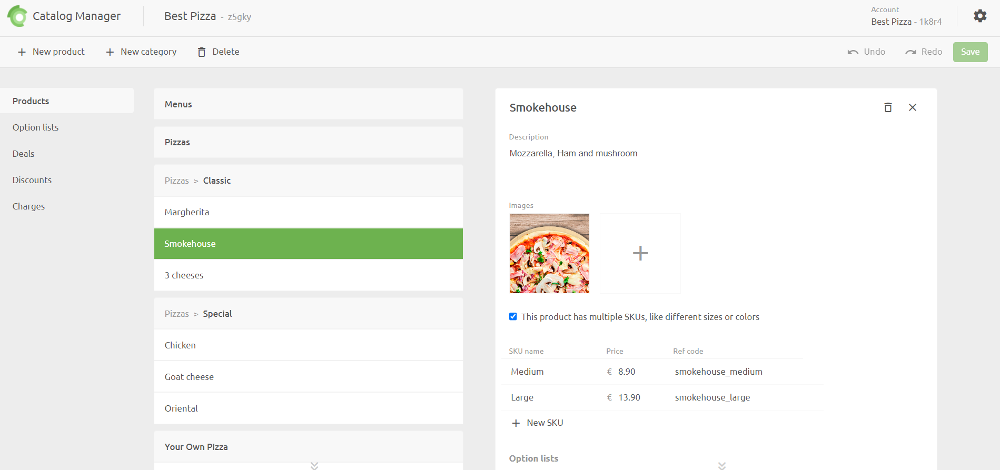
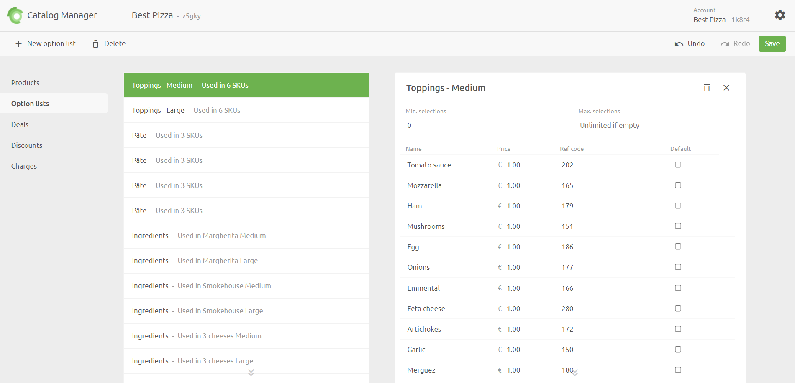
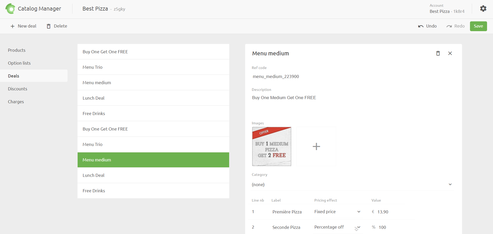
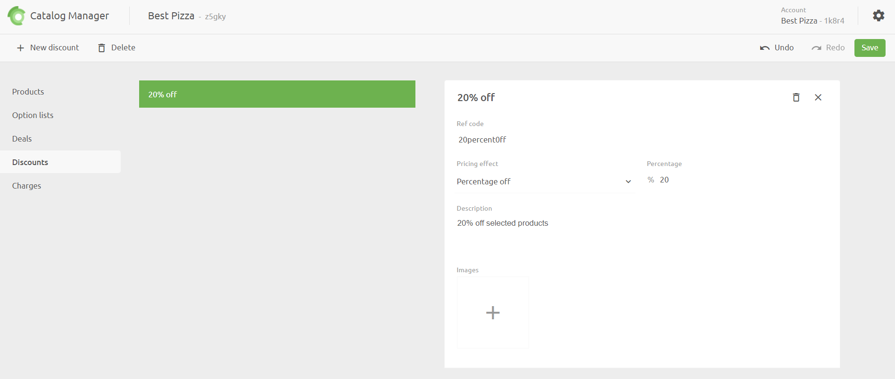
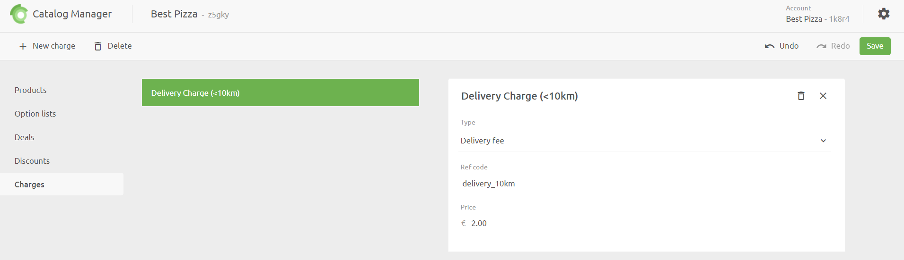

## Catalogs

A **Catalog** is simply a container for your products and their associated details.  In Catalog Manager you can create multiple catalogs to cater for different business scenarios. Catalogs can also be created globally across all locations, or at specific locations.  At one location, you may, for example, create one catalog that imports products from your EPOS and synchronises with an online ordering system.  At another location, you may create a catalog which is manually maintained and is used only to populate and maintain an online menu.

When you open Catalog Manager from the Connections console, the **Catalogs** page is displayed.  From here you can add new catalogs, rename, duplicate or delete existing ones.

## Products

When you open a Catalog, the Product page is displayed.  This lists all your products grouped by Category. To add a new category, click **New category** and enter a name.  

For each product, the following can be viewed/edited in the details pane:

- Description
- Images
- Variations
- Options List

Variations are typically used to provide different varieties of the base product, such as size.  Options allow you to specify optional items over and above the varations.

---

**IMPORTANT NOTE:** Each variation has its own Ref code and price which must be entered. If a product has no variations, then a Ref code (and price) for the base product needs to be entered.

---

You can re-arrange the order in which items are displayed in each category by using the drag handle to drag and drop products.

## Option Lists

Options are additional items which customers can add to a product when ordering.  When you create a product, you can choose to create a relationship between the product and an Options List.  The Options List needs to be created before you can relate them to a product item.

To create an Options List, click on **Options Lists** > **New option** list.  The following information is required:

- Name
- Minimum number a customer can select
- Maximum number a customer can select
- For each option, enter a name, price, Ref code and default flag

Keep in mind that and Options Lists are related to specific products (or product variations), so it is useful to name your Options List appropriately.  For example, for a medium pizza variation you may have 2 sauce options which you would include in an Options List called 'Sauce - Medium Pizza'.

## Deals

Deals are special offers that you can configure for your menu. A typical example could be a 'buy one get one free' deal. There are several ways that you can set deals up to meet your specific requirements. This includes offering percentage or absolute discounts and limiting the deal to certain products.

## Discounts

Discounts are simple percentage or amount discounts that can be applied on a total purchase, as opposed to a specific product item.

## Charges

Charges are flat fees that you can apply to a total purchase for things like delivery, fees, tips or other costs.

