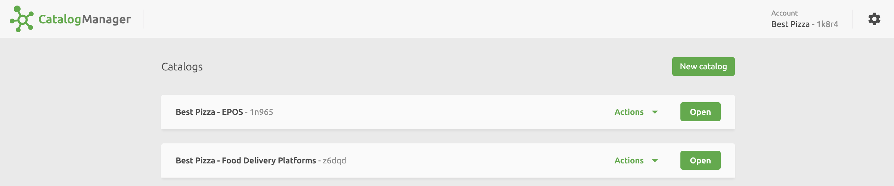
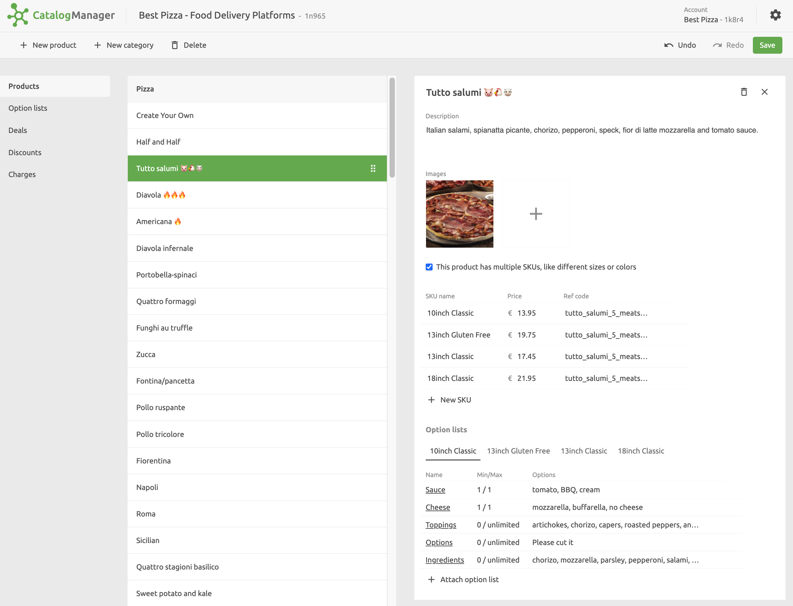
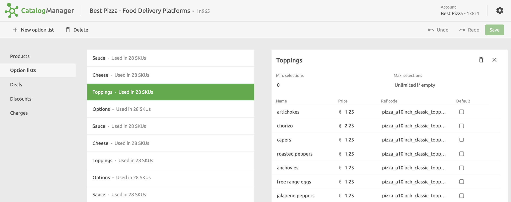
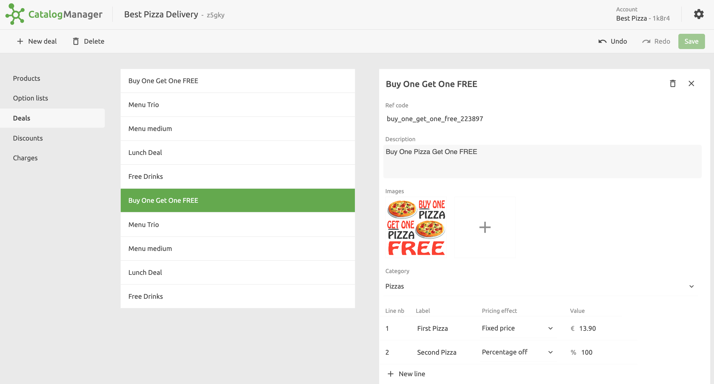
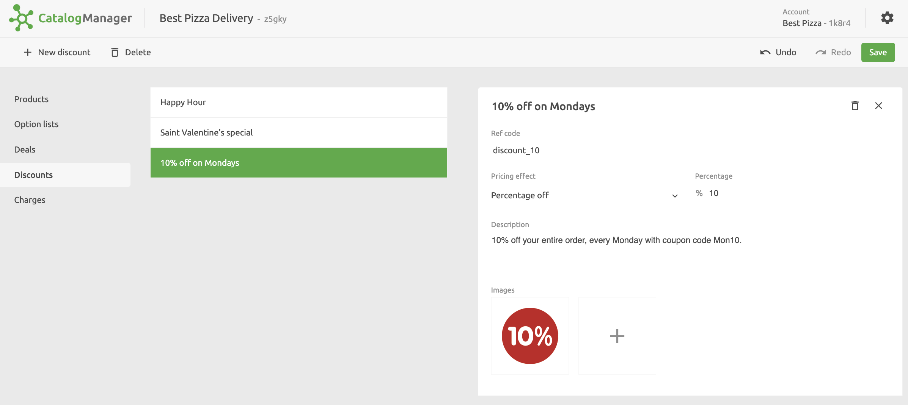

## Catalogs

A **Catalog** is simply a container for your products and their associated details. In Catalog Manager you can edit or create multiple catalogs to cater for different business scenarios.

Catalogs can be created globally across all locations, or at a specific location level. For more information, refer to the HubRise Help page [Accounts](https://www.hubrise.com/docs/account) and [Locations](https://www.hubrise.com/docs/locations). At one location, you may, for example, create one catalog that imports products from your EPOS and synchronises with an online ordering system. At another location, you may create a catalog which is manually maintained and is used only to populate and maintain an online menu.You have also have multiple catalogs on the same location.

When you open Catalog Manager from the HubRise back office **CONNECTIONS** page, the Catalog Manager **Catalogs** page is displayed. From here you can create new catalogs. You can also use the **Actions** dropdown to **Rename**, **Duplicate** or **Delete** existing ones.

## Products

When you open a Catalog, the **Products** page is displayed. This lists all your products grouped by Category. To add a new category, click **New category** and enter a name.

For each product, the following can be viewed and edited in the product's details pane:

- Product name
- Description
- Images
- Variations, referred to as **SKUs**
- Options List

Variations are typically used to provide different varieties of the base product, such as size or colour. Options allow you to specify optional additional items, such as extras.

---

**IMPORTANT NOTE:** Each variation has its own ref code and price which must be entered if you are connecting an EPOS. If a product has no variations, then the ref code for the base product needs to be entered.

---

You can rearrange the order in which items are displayed in each category by using the drag handle <InlineImage width="20" height="20"></InlineImage> to drag and drop products. The order in which products display in the Catalog Manager is the oder in which they will display in the app you push the catalog into.

## Option Lists

Options are additional items which customers can add to a product when ordering. When you create a product, you can choose to create a relationship between the product and an Options List. The Options List needs to be created before you can relate them to a product item. Options list might differ from one product variation to another; for example, additional toppings on a medium pizza could be cheaper and different than those offered on a large pizza.

When viewing option lists, you can see the number of SKUs or the products that the option list is used in. This helps you to keep track of which options are used in which products.

## Deals

Deals are special offers that you can configure for your menu. There are several ways that you can set deals up to meet your specific requirements. This includes offering percentage or absolute discounts and limiting the deal to certain products. A typical example could be a `Buy One Get One FREE` deal. For more information, see [Manage Deals](/apps/catalog-manager/manage-deals-discounts-charges#manage-deals).

## Discounts

Discounts are simple percentage or amount discounts that can be applied on a total purchase, as opposed to a specific product item. For more information, see [Manage Discounts](apps/catalog-manager/manage-deals-discounts-charges#manage-discounts).

## Charges

Charges are flat fees that you can apply to a total purchase for things like delivery fees, tips or other costs. For more information, see [Manage Charges](/apps/catalog-manager/manage-deals-discounts-charges#manage-charges).

