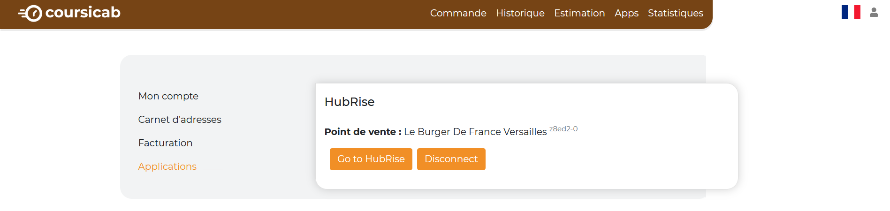

Vous pouvez connecter CoursiCab à HubRise de manière autonome, en seulement quelques étapes.

## Connecter CoursiCab

Pour établir la connexion entre CoursiCab et HubRise :

1. Dans votre espace CoursiCab, cliquez sur l'icône de compte, en haut à droite. Un menu déroulant apparaît.
1. Cliquez sur **Mon compte**, puis sur **Applications**. Vous devriez voir la page suivante :
   
1. Cliquez sur **Se connecter à HubRise**. L'interface HubRise s'ouvre dans un nouvel onglet.
1. Sélectionnez le point de vente à connecter et cliquez sur **Autoriser** pour donner à CoursiCab l'accès à vos données.
1. En cas de besoin, le support de CoursiCab peut vous venir en aide. Pour leur donner accès à votre compte HubRise, [ajoutez les permissions nécessaires](/apps/coursicab/connect-hubrise#give-access).

---

**REMARQUE IMPORTANTE :** Vous devrez vous connecter à un compte HubRise existant, ou créer un nouveau compte pour finaliser la connexion. Pour plus d'informations sur la manière de créer un profil utilisateur ou vous connecter à HubRise, consultez notre [Guide de prise en main](/docs/get-started).

---

## Tester la connexion

Pour tester la connexion entre CoursiCab et HubRise, un moyen simple est d'utiliser une autre application connectée au même point de vente HubRise, et capable d'envoyer des commandes vers HubRise. Il peut s'agir par exemple d'une solution de commande en ligne ou de votre logiciel de caisse.

1. Passez une commande depuis l'autre application.
1. Dans votre espace CoursiCab, sélectionnez **Apps** dans la barre de menu.
1. Si la commande n'apparaît pas dans CoursiCab, vérifiez qu'elle a bien été envoyée à HubRise. Pour cela, allez dans le back-office de HubRise, dans le menu latéral, sélectionnez **DONNÉES** > **COMMANDES**. Vérifiez que la commande est présente dans la liste des commandes.

## Donner accès au support de CoursiCab {#give-access}

Pour faciliter la prise en charge de vos demandes de support, nous vous recommandons de donner accès à votre compte HubRise à l'éditeur de la solution CoursiCab.

Pour donner accès à CoursiCab, procédez comme suit :

1. Depuis le back-office de HubRise, sélectionnez **CONFIGURATION** dans le menu de gauche.
1. Dans la section **Permissions**, ajoutez it@coursicab.com en sélectionnant l'option **Manager** dans la liste déroulante des rôles.
1. Cliquez sur l'icône **+** pour ajouter le nouvel utilisateur.

L'ajout d'un utilisateur est le moyen recommandé de donner accès à un tiers à votre point de vente. Le partage de mot de passe est déconseillé pour des raisons de sécurité.

## Déconnecter CoursiCab

1. Dans votre espace CoursiCab, puis cliquez sur l'icône de compte, en haut à droite. Un menu déroulant s'affiche.
1. Cliquez sur **Mon compte**, puis sur **Applications**. Vous devriez voir la page suivante :
   
1. Cliquez sur **Disconnect**.
