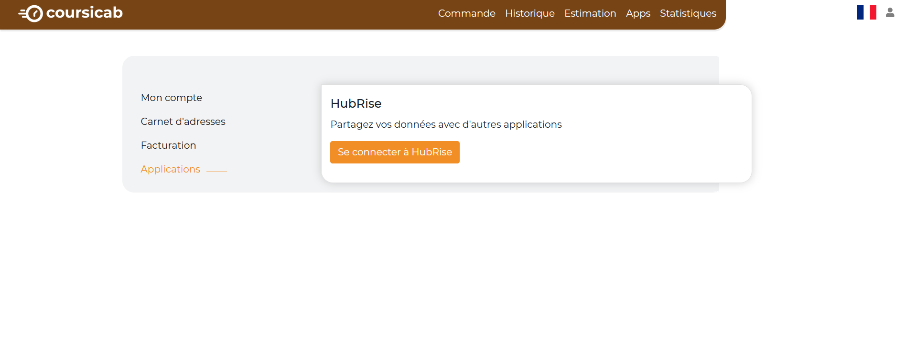
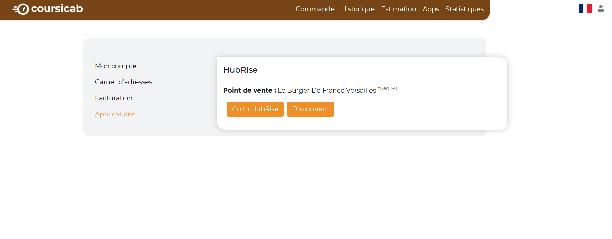

Vous pouvez connecter CoursiCab à HubRise de manière autonome, en seulement quelques étapes.

## Connecter CoursiCab

Pour établir la connexion entre CoursiCab et HubRise :

1. Dans votre espace CoursiCab, cliquez sur l'icône de compte, en haut à droite. Un menu déroulant s'affiche.
1. Sélectionnez **Mon compte**.
1. Cliquez sur **Applications**.
   
1. Cliquez sur **Se connecter à HubRise**. L'interface HubRise s'affiche dans un nouvel onglet.
1. Choisissez le point de vente que vous désirez connecter et cliquez sur **Autoriser** pour donner à CoursiCab l'accès à vos informations.
1. En cas de besoin, le support de CoursiCab peut vous venir en aide. Pour leur donner accès à votre compte HubRise, [ajoutez les permissions nécessaires](/apps/coursicab/connexion-hubrise#donner-acc-s-au-support-de-coursicab).

---

**REMARQUE IMPORTANTE :** Vous devrez vous connecter à un compte HubRise existant, ou créer un nouveau compte pour terminer d'établir la connexion. Pour plus d'informations sur la manière de créer un profil utilisateur ou vous connecter à HubRise, consultez notre [Guide de prise en main](/docs/getting-started/).

---

## Tester la connexion

Pour vérifier que la connexion entre CoursiCab et HubRise est correctement établie, vous devez disposer d'une autre application connectée au même point de vente HubRise, et capable d'envoyer des commandes vers HubRise. Il peut s'agir par exemple d'une solution de commande en ligne ou de votre logiciel de caisse.

1. Passez une commande depuis l'autre application connectée.
1. Dans votre espace CoursiCab, dans la barre de menu, sélectionnez **Apps**.
1. Si la commande n'apparaît pas dans CoursiCab, vérifiez qu'elle a bien été envoyée à HubRise. Pour cela, allez dans votre espace HubRise, dans le menu latéral, sélectionnez **DONNÉES** > **COMMANDES**. Vérifiez que la commande est présente dans la liste des commandes.

## Donner accès au support de CoursiCab

Il est conseillé de donner au support de CoursiCab l'accès à votre compte HubRise. En cas de besoin, ils pourront ainsi vous venir en aide plus facilement. Pour cela, suivez les étapes suivantes :

1. Depuis votre espace HubRise, sélectionnez **CONFIGURATION** > **COMPTES** dans le menu de gauche. La liste de vos comptes s'affiche.
1. Sélectionnez le compte auquel votre point de vente est rattaché.
1. Dans la section **Points de vente**, sélectionnez votre point de vente.
1. Dans la section **Permissions**, ajoutez *it@coursicab.com* en sélectionnant l'option **Manager** (et non **Admin**) dans la liste déroulante des rôles, puis cliquez sur l'icône *+*. L'ajout d'un utilisateur est le moyen recommandé de donner accès à un tiers à votre point de vente, le partage de mot de passe est déconseillé pour des raisons de sécurité.

## Déconnecter CoursiCab

1. Dans votre espace CoursiCab, puis cliquez sur l'icône de compte, en haut à droite. Un menu déroulant s'affiche.
1. Sélectionnez **Mon compte**.
1. Cliquez sur **Applications**.
   
1. Cliquez sur **Disconnect**.