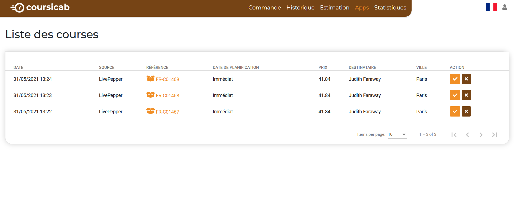
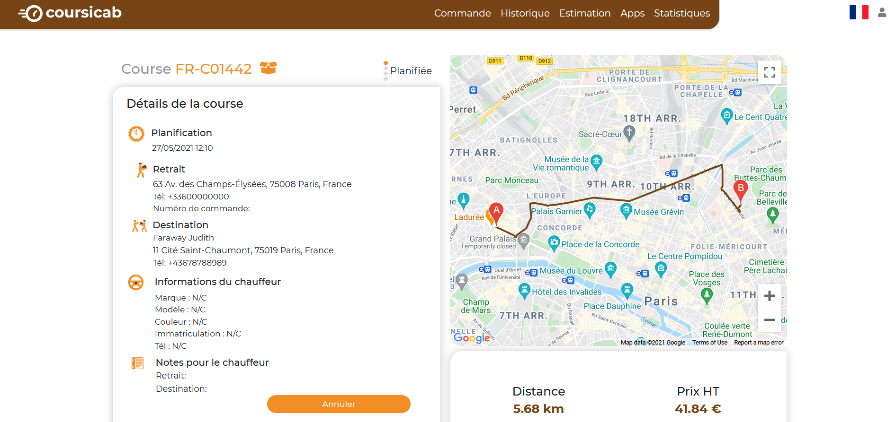

Le back-office de CoursiCab permet de consulter les commandes HubRise, et de sélectionner celles que vous souhaitez faire livrer.

## Courses

Dans CoursiCab, les livraisons sont appelées des courses. Pour en consulter la liste, dans votre espace CoursiCab, cliquez sur **Apps** dans la barre de menu.

Pour chaque course, vous pouvez accepter ou refuser la livraison.

Pour accepter, suivez les étapes suivantes :

1. Dans la colonne **ACTION**, cliquez sur le bouton d'acceptation en forme de coche.
1. Sélectionnez un véhicule et un mode de paiement dans la modale qui s'affiche :
   
1. Cliquez sur **Confirmer**.

Pour refuser :

1. Dans la colonne **ACTION**, cliquez sur le bouton de rejet en forme de croix. Une modale de confirmation s'ouvre.
1. Cliquez sur **Oui** pour confirmer l'annulation de la course.

## Historique

Pour consulter l'historique de vos courses, dans votre espace CoursiCab, cliquez sur **Historique** dans la barre de menu.

Lorsqu'une livraison est en cours, le statut de la course passe successivement en **Transit** puis en **Livrée**.

Pour voir le détail de la course, cliquez sur le bouton dans la colonne **ACTION**. Une nouvelle page indique les adresses de retrait et de livraison, les informations du chauffeur, le prix de la course et l'historique des changements de statuts.

