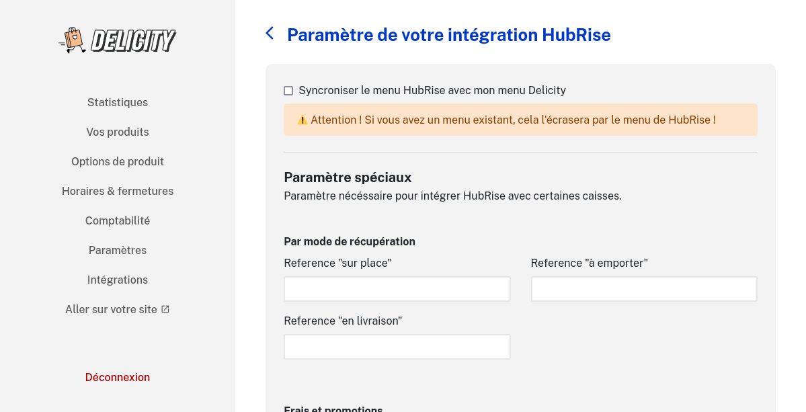
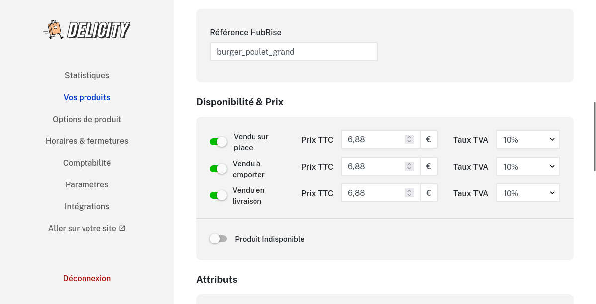
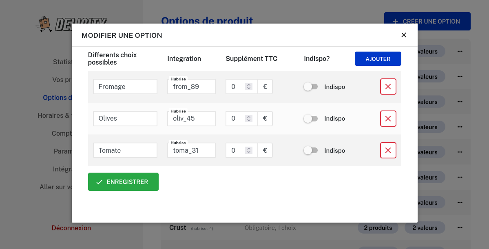

Pour s'assurer de la bonne réception des commandes Delicity sur votre caisse, l'ensemble de vos produits et options sur Delicity doivent être associés au code ref correspondant sur votre logiciel de caisse.

Pour cela, vous pourrez soit synchroniser votre catalogue automatiquement depuis HubRise, soit saisir manuellement vos codes refs sur Delicity.

## Synchronisation automatique du catalogue

---

**REMARQUE IMPORTANTE :** Cette opération va remplacer votre catalogue Delicity.

---

Pour activer la synchronisation automatique du catalogue depuis HubRise, suivez ces étapes :

1. Depuis le back office de Delicity, cliquez sur **Intégrations**.
2. Dans la section **HubRise**, cliquez sur **Paramètres**.
3. Cocher la case **Synchroniser le menu HubRise avec mon menu Delicity**, puis **Sauvegarder**
   

L'activation de la synchronisation provoque deux actions :

- Votre catalogue Delicity est immédiatement remplacé par le catalogue HubRise.
- Votre catalogue Delicity est mis à jour automatiquement à chaque modification de votre catalogue HubRise.

## Saisie manuelle des codes refs

### Produits

Pour modifier le code ref d'un produit, suivez ces étapes :

1. Depuis le back office Delicity, dans le menu de gauche, cliquez sur **Vos Produits**.
1. Cliquez sur le produit souhaité pour ouvrir la fiche produit. Le champ **Référence HubRise** se trouve dans la section **Intégration**
1. Modifiez le code ref du produit et cliquez sur le bouton **Enregistrer** en bas de page.
   

### Options

Les options sur HubRise correspondent aux options sur Delicity.

Pour modifier le code ref d'une option, suivez ces étapes :

1. Depuis le back office Delicity, dans le menu de gauche, cliquez sur **Options de produit**.
1. Cliquez sur les trois points à droite de la liste d'options souhaité puis **Modifier**. Une pop-up s'ouvre et vous pouvez saisir le code ref dans la colonne **Intégration**, champ **HubRise**
1. Modifiez le code ref de l'option et cliquez sur le bouton **Enregistrer** en bas de page.
   
