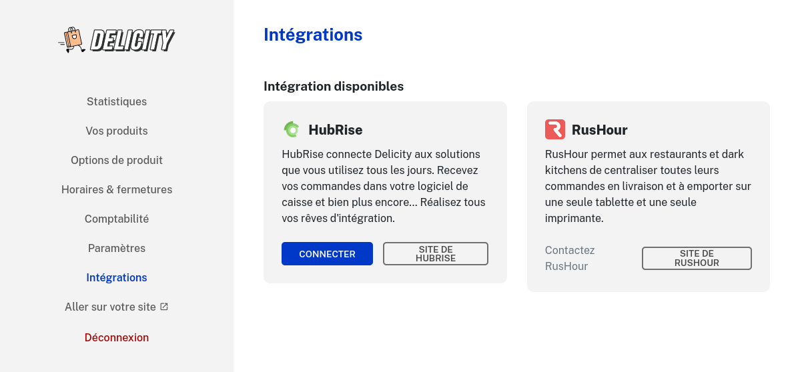

---

**REMARQUE IMPORTANTE :** Si vous ne possédez pas encore de compte HubRise, commencez par en ouvrir un sur la [page d'inscription à HubRise](https://manager.hubrise.com/signup). L'inscription ne prend que quelques minutes !

---

## Connecter Delicity

Pour connecter Delicity à HubRise, suivez les étapes suivantes :

1. Créez un compte HubRise. Pour plus d'information, consultez notre [Guide de démarrage](/docs/get-started).
1. Depuis le back-office de Delicity, cliquez sur **Intégrations**
   

1. Dans la section **HubRise**, cliquez sur **CONNECTER**.
1. Vous êtes redirigé vers l'interface HubRise.
1. Si vous avez plusieurs points de vente, choisissez le point de vente à connecter. Si le point de vente sélectionné possède plusieurs listes de clients ou catalogues, cliquez sur **Suivant** pour afficher les listes déroulantes correspondantes, puis sélectionnez les options voulues.
1. Cliquez sur **Autoriser**.
1. Vous êtes redirigé vers l'interface de Delicity.
1. La connexion à HubRise est établie.

## Donner accès au support de Delicity

Pour faciliter la prise en charge de vos demandes de support, nous vous recommandons de donner accès à votre compte HubRise à l'éditeur de la solution Delicity.

Pour donner accès à Delicity, procédez comme suit :

1. Depuis le back-office de HubRise, sélectionnez **CONFIGURATION** dans le menu de gauche.
1. Dans la section **Permissions**, ajoutez contact@delicity.com en sélectionnant l'option **Manager** dans la liste déroulante des rôles.
1. Cliquez sur l'icône **+** pour ajouter le nouvel utilisateur.

L'ajout d'un utilisateur est le moyen recommandé de donner accès à un tiers à votre point de vente. Le partage de mot de passe est déconseillé pour des raisons de sécurité.

## Contacter le support de Delicity

Pour toute demande de support, contactez l'équipe de Delicity par email sur contact@delicity.com. Vous pouvez inclure support@hubrise.com en copie pour un suivi coordonné entre nos deux équipes.

Pensez à indiquer le nom de votre compte HubRise, son identifiant HubRise et le point de vente concerné par votre demande de support. Pour plus d'informations voir [Nom et identifiant du point de vente](/docs/locations#location-name-and-id).

## Déconnecter Delicity

1. Depuis le back-office de Delicity, cliquez sur **Intégrations**
2. Dans la section **HubRise**, cliquez sur **Deconnexion**.
   

3. Delicity est déconnecté de HubRise.
