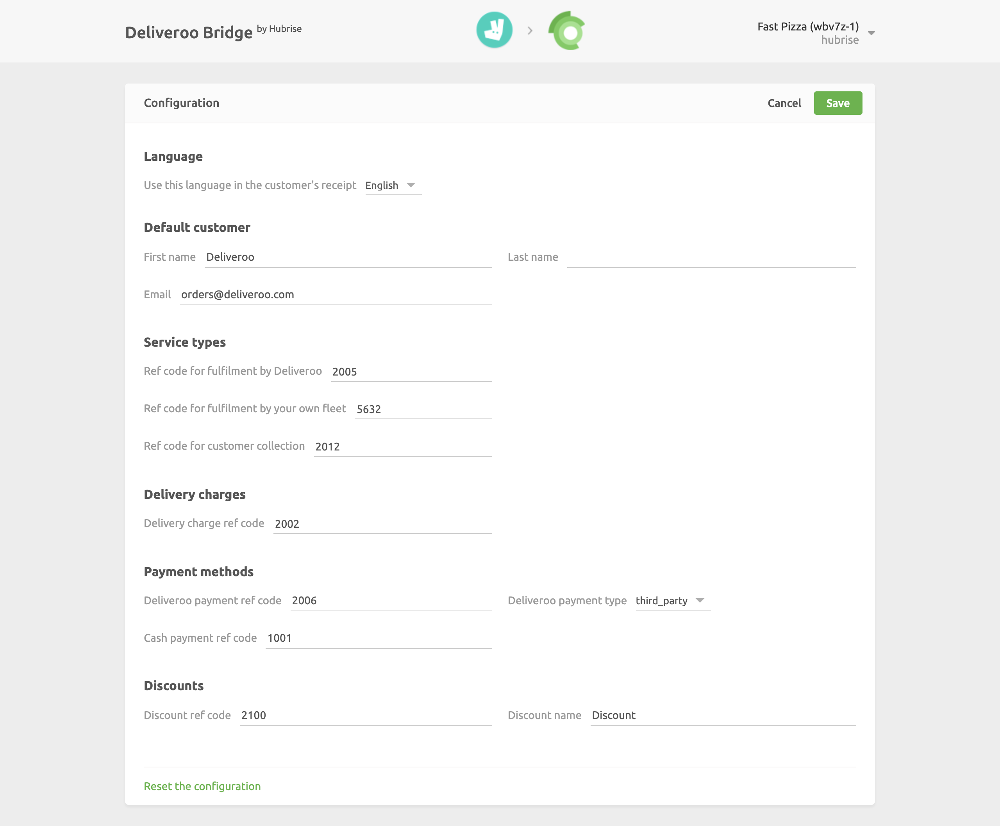

The Configuration page allows you to customise the behaviour of the Deliveroo Bridge based on your preferences.
These are divided into different categories for an easier navigation.

## Language

From this section, you can decide which language will be used to encode the order item names in your receipts.

## Default Customer

By default, Deliveroo does not encode the customer's details when they send an order to HubRise.

However, certain POS systems require a customer to be specified in every order.
This section allows you to define the default first name, last name and email address that will be used for all your Deliveroo orders.

## Service Types

This section allows you to specify the default ref codes used for all the service types.

## Delivery Charges

This section allows you to specify the ref code associated with the delivery charge.

## Payment Methods

Deliveroo customers can pay their order either online or by cash on delivery.

This section of the Configuration page allows you to specify the ref codes for these two payment methods, together with the payment type associated with online payments on the Deliveroo web site. Cash payments are always associated with the `cash` type.

## Discounts

This section allows you to specify the discount name and ref code applied to your products, in case you have one active on your Deliveroo page.

## Saving the Configuration

Once you are happy with the configuration of the Deliveroo Bridge, click **Save** at the top of the page to continue to the main page.

## Resetting the Configuration

You can always restore the Configuration page to its default values and change the Deliveroo location ID associated with your HubRise location by clicking on **Reset the configuration** at the bottom of the page.
