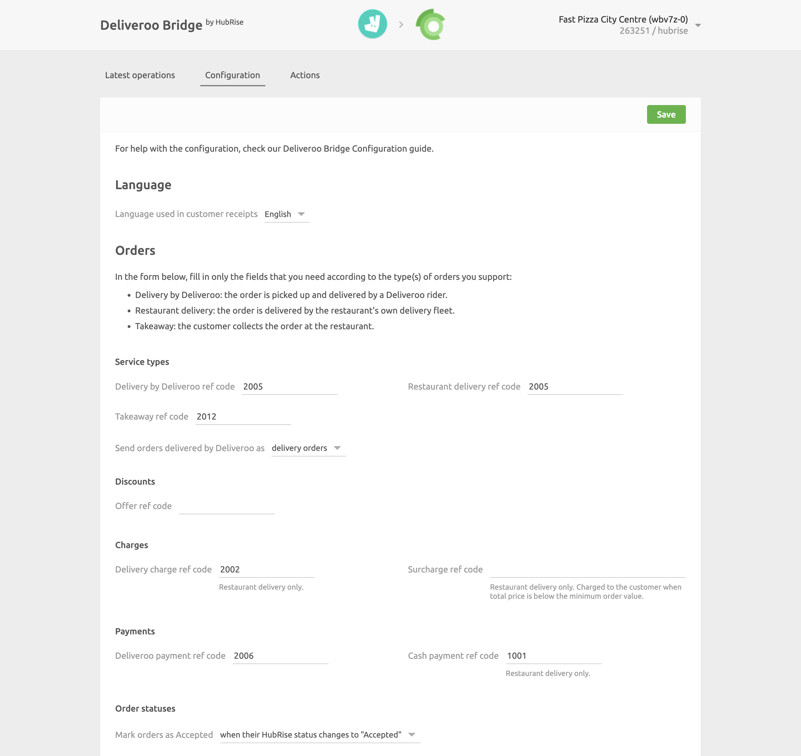
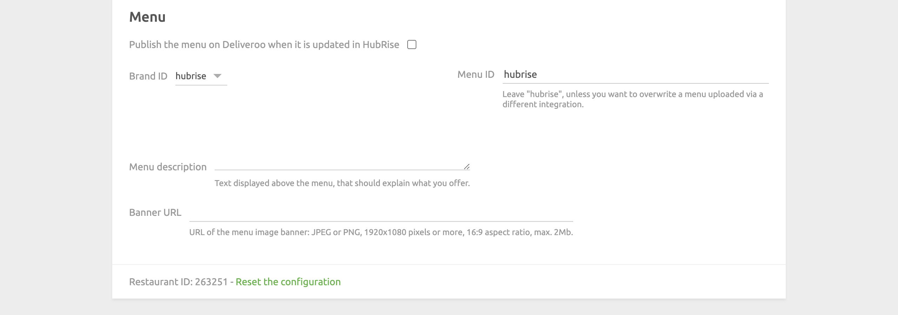

The configuration page allows you to customise the behaviour of Deliveroo Bridge based on your preferences.
These are divided into different sections for an easier navigation.

## Language

From this section, you can decide which language is used to localise your receipts.

## Orders

### Service Types

Service types such as delivery by Deliveroo, restaurant delivery or takeaway might require the corresponding ref code entry. Refer to your connected EPOS documentation on the HubRise website to verify.

Additionally, from this section you can choose to mark Deliveroo orders as delivery orders or collection orders.
This is useful if you have specific business requirements for financial reporting.

### Discounts

This section allows you to specify the discount ref code applied to your products, in case you have one active on your Deliveroo page. Refer to your connected EPOS documentation on the HubRise website to see how to obtain the corresponding ref code.

Available discounts on Deliveroo appear in the **All offers** page in your Deliveroo back office.

### Charges

If charges apply, a ref code might be required. Refer to your connected EPOS documentation on the HubRise website to verify.

In this section, you can specify the ref code for delivery charges, and for surcharges applied to orders below the minimum price.

### Payments

Deliveroo customers can pay for their order either online or by cash for restaurant delivery orders.

This section of the configuration page allows you to specify the ref codes for these two payment methods. Refer to your connected EPOS documentation on the HubRise website to verify the correct codes to use.

### Order Statuses

Deliveroo requires you to acknowledge every order you receive.
In this section, you can select which HubRise status sends an order confirmation back to Deliveroo.
Refer to your connected EPOS documentation on the HubRise website to verify the correct value. 

## Menu

In this section, you can choose to automatically publish the menu every time it is updated on HubRise. By default, this feature is turned off.

Additionally, you can customize the brand ID and menu ID values, even though the default values generally work for most customers.

Finally, include the menu description and URL for the banner image that you want to show on your Deliveroo store.

To obtain a public URL for your banner image, send an email to [support@hubrise.com](mailto:support@hubrise.com) including an image with the following requirements:

- at least 1920x1080 pixels, 16:9 ratio
- JPG or PNG format
- less than 2 Mb

---

**IMPORTANT NOTE:** The menu description and banner image are required to successfully publish your menu to Deliveroo.

---

## Saving the Configuration

Once you are happy with the configuration of Deliveroo Bridge, click **Save** at the top of the page to go back to the Operations page.

## Resetting the Configuration

If you want to reset the configuration and erase its values, click **Reset the configuration** at the bottom of the page.

---

**IMPORTANT NOTE:** Resetting the configuration will also erase your Deliveroo Restaurant ID. To continue receiving Deliveroo orders, you will need to enter your Deliveroo Restaurant ID again.

---

Resetting the configuration does not remove the operation logs displayed in the main page.
