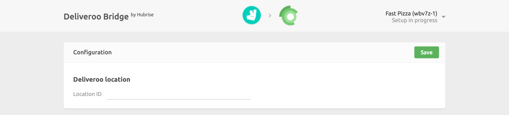

To connect Deliveroo to HubRise, the Deliveroo team needs to log your HubRise location in their back office.

Don't worry, HubRise will take care of all the paperwork for you!

## Before Connecting Deliveroo

...

## Connect the Deliveroo Bridge to HubRise

---

**IMPORTANT NOTE:** Deliveroo Bridge connects to HubRise at the location level.

---

To connect Deliveroo to HubRise, you first need to log in to your HubRise account.
If you don't have a HubRise account, go to the [HubRise Signup Page](https://manager.hubrise.com/signup) and follow the instructions.

1. Select **CONNECTIONS** from the HubRise back office, then **View available apps**.
1. Select **Deliveroo** from the list of apps.
1. Click **Connect**.
1. Grant Deliveroo permission to access the location of your restaurant registered in HubRise.
   1. If your account has not yet been created on HubRise, select **Create a new location**.
   1. For accounts with multiple locations, expand the **Choose location** section to select the correct one and click on **Allow**.

You have now added Deliveroo to your HubRise apps.
The next step is configure the connection.

## Location ID

---

**IMPORTANT NOTE:** In order to connect your Deliveroo restaurant to HubRise, you need to provide a valid location ID.

---

In the first configuration page, you will need to enter the location ID that has been assigned to you by Deliveroo.
This is necessary to correctly route the incoming orders to your HubRise location.

Once you are finished, click **Save**.
