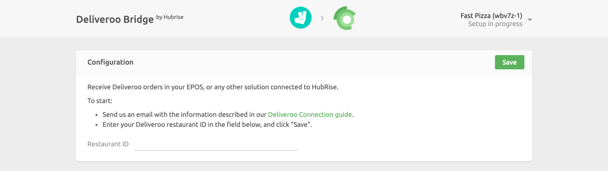

Connecting Deliveroo to HubRise can be done with a few steps.

---

**IMPORTANT NOTE:** If you do not have a HubRise account yet, register on our [Signup Page](https://manager.hubrise.com/signup). It only takes a minute!

---

## 1. Enable HubRise on Deliveroo

As a first step, the HubRise integration must be enabled on your Deliveroo account.

Contact us at support@hubrise.com and include the following information in your email:

- The URL link to your restaurant page on the Deliveroo website. For example: https://deliveroo.co.uk/menu/london/clapham/camile-thai-clapham.
- Whether your Deliveroo store is connected to another middleware or EPOS.
- Your HubRise location name and identifier. For example: `Fast Pizza Baker Street z6q31-0`.

With this information in hand, we will ask the Deliveroo integration team to enable the HubRise connection for your store.

Alternatively, you can connect your store autonomously. For more information, see [Connect to HubRise From the Deliveroo Back Office](/apps/deliveroo/faqs/connect-from-deliveroo-back-office).

## 2. Connect Deliveroo Bridge {#connect}

To connect Deliveroo Bridge to HubRise, follow these steps.

1. Log in to your [HubRise account](https://manager.hubrise.com).
1. Select the location you want to connect from the dropdown menu.
1. Select **CONNECTIONS**, then **View available apps**.
1. Select **Deliveroo** from the list of apps.
1. Click **Connect**.
1. Click **Allow** to grant Deliveroo Bridge access to your registered location on HubRise. If your account has multiple locations, expand the **Choose location** section to select the desired location, and then click **Allow**.
1. A new page asks you to provide your Deliveroo Restaurant ID. Enter the ID, then click **Save** to complete the connection process.

## 3. Configure Your Preferences

After connecting the bridge, you need to configure a few parameters on the **Configuration** page to send orders correctly to your EPOS.

For more information about the configuration page and how to navigate to it, see the User Interface [Configuration](/apps/deliveroo/user-interface#configuration) page. For details on how to configure the parameters of Deliveroo Bridge, see [Configuration](/apps/deliveroo/configuration).

## 4. Map Products Ref Codes

Each product in Deliveroo needs to have a corresponding ref code. This ensures that your EPOS can identify every item correctly.

To learn how to map ref codes on Deliveroo, see [Map Ref Codes](/apps/deliveroo/map-ref-codes).

---

**IMPORTANT NOTE:** Deliveroo will not enable the HubRise connection if some product ref codes are missing.

---
