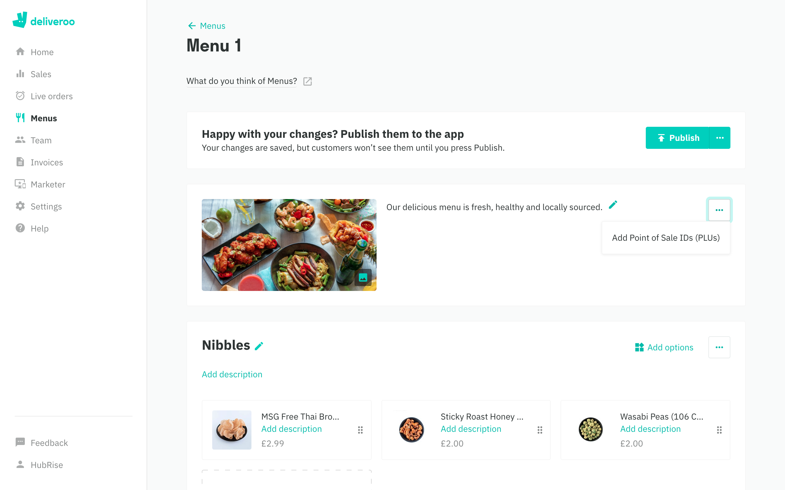

Most EPOS solutions require a ref code for each product and option to properly interpret orders. As such, when you create your menu on Deliveroo, you need to make sure that every product and option is assigned to the appropriate ref code.

---

**IMPORTANT NOTE:** Failing to assign ref codes can result in Deliveroo being unable to process the order correctly. For more information, see the [Orders Not Received](/apps/deliveroo/troubleshooting#orders-not-received) section of the Troubleshooting page.

---

To assign ref codes to your Deliveroo products with the Menu Manager tool in Deliveroo back office, follow these steps:

1. Log in to your [Deliveroo back office](https://restaurant-hub.deliveroo.net/).
1. From the menu on the left, select **Menus**.
1. Click **Edit menu**. If you have multiple menus, make sure you edit the correct one.
   
1. Click on the <InlineImage width="24" height="24"></InlineImage> symbol next to the menu description, then select **Add Point of Sale IDs (PLUs)**. Make sure you do not accidentally click on the triple dot button next to an item category.
   
1. Enter the correct ref code for each product in the list.
   
1. Click **Save** to confirm the mapping.
1. Click **Publish** to finalise your mapping. Changes to the menu will be available online only after you publish them.
   

---

**IMPORTANT NOTE:** Assigning ref codes to products manually from the Deliveroo Menu Manager tool is not possible if your Deliveroo account is configured to update ref codes via Menu API. To switch to Menu Manager and see PLU fields in your Deliveroo back office, contact [support@deliveroo.co.uk](support@deliveroo.co.uk).

---
