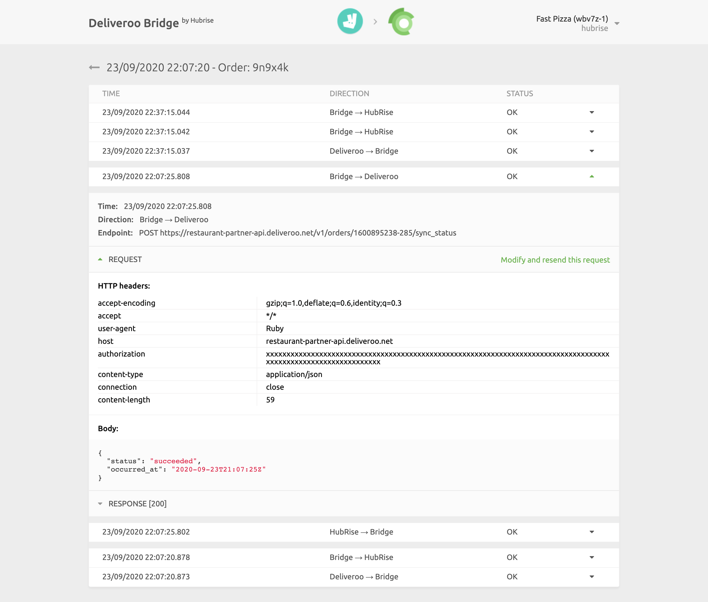

## API Requests Logs

Selecting an order from the list in the main page will display all the logs of the API requests exchanged between HubRise and Deliveroo via the Deliveroo Bridge.

Requests are ordered with the latest on top, and those related to the same order event (order received, order cancelled, etc.) are visually grouped together.

Each row in the logs displays the following information:

- **TIME**: The date and time the request was sent.
- **DIRECTION**: The apps sending and receiving the request, in the format Origin → Destination.
- **STATUS**: The status of the request. The value OK indicates that the request has been successfully received, otherwise a message will explain the type of error occurred.

Clicking on a request will expand it to reveal the detailed logs of the request and its response.

Logs are a powerful debugging tool in case of issues. To understand in detail how to read logs, see the [HubRise documentation](/docs/hubrise-logs/).
