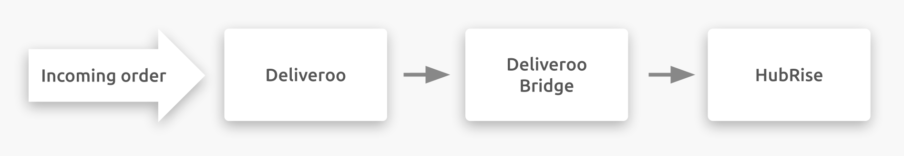

## Description

Deliveroo is an online delivery platform for restaurants and convenience stores.
It is based in the United Kingdom but operates in 13 different countries in Europe, Asia, and Oceania.

Deliveroo connects to your HubRise account through Deliveroo Bridge, an app developed by HubRise.

## Integration Features

Connecting Deliveroo Bridge allows HubRise to:

- Pull orders from Deliveroo, including order status.
- Pull customer information from Deliveroo, for orders delivered by the restaurant.
- Push a catalog into Deliveroo.
- Synchronise inventory with HubRise.

---

**IMPORTANT NOTE:** HubRise has partnered with Deliveroo to offer a new tabletless integration experience. This allows you to receive Deliveroo orders directly in HubRise without the need for a Deliveroo tablet. For more information, see [How Can I Abandon the Deliveroo Tablet?](/apps/deliveroo/faqs/abandon-deliveroo-tablet/)

---

Deliveroo Bridge can be connected to HubRise from the HubRise back office.

## Why Connect?

Connecting your Deliveroo online restaurant or convenience store to HubRise allows you to receive Deliveroo orders directly in your EPOS or Kitchen Display System also connected with HubRise.
You will be able to manage Deliveroo orders alongside other orders, using your own tools. Deliveroo orders will flow through your existing setup, as all other orders already do.

Via HubRise, synchronise your menu, your customer and order information with online ordering, food delivery platforms (including Deliveroo, Uber Eats and Just Eat), delivery management, delivery services, eMarketing (SMS/emailing), business intelligence, stock management, loyalty systems, and more. The number of compatible applications increases every month. To see which apps you can connect, see our [Apps page](/apps).

## Prerequisites

To establish a connection between Deliveroo and HubRise, your restaurant must be a Deliveroo partner.
