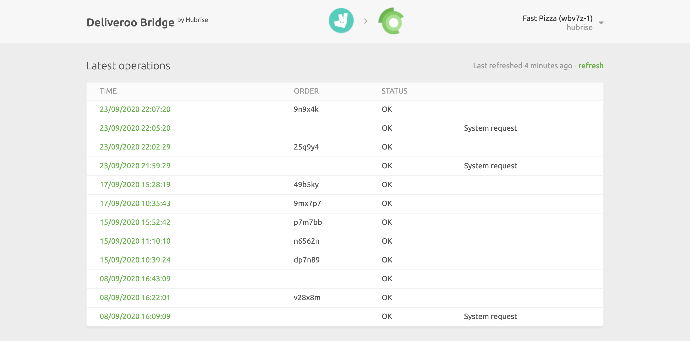

From the main page of the Deliveroo Bridge, you can access the configuration settings of the app and read the logs of all the transactions between HubRise and Deliveroo.

## Main Page

The main page displays the latest API exchanges between HubRise, Deliveroo, and Deliveroo Bridge. Each row shows:

- **TIME**: The date and time of the order.
- **ORDER**: The HubRise order ID.
- **STATUS**: The status of the order. The value OK indicates that the order has been successfully sent, otherwise a message will explain the type of error occurred.

Clicking on a particular row will open a new page displaying the logs associated with the order. For more details, see [Order Logs](/apps/deliveroo/order-logs).

At the top right corner of the main page, you can click on the arrow <InlineImage width="20" height="20"></InlineImage> to expand the menu. From there, you can select the language of the page and access the configuration page. For more details on how to customise the behaviour of the Deliveroo Bridge, see [Configuration Page](/apps/deliveroo/configuration).

Clicking on the Deliveroo and HubRise logos on top of any page of the Deliveroo Bridge will bring you back to the main page.
