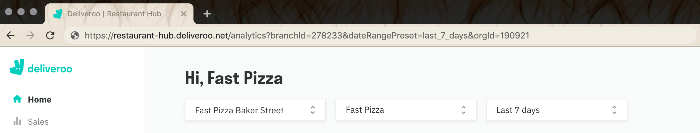

The **Restaurant ID** is the unique identifier for your Deliveroo store. It is also referred to as **Branch ID**, **Admin ID**, **Tablet ID**, or **Location ID**, depending on the context. This ID consists solely of numeric characters and usually contains 6 digits, although sometimes it may have 5.

To find your Deliveroo Restaurant ID, choose one of the following methods.

## Option 1 - Via the Deliveroo Tablet

To find your restaurant ID using your Deliveroo tablet:

1. Tap the navigation button on the top right of the page.
1. Your ID is the number between brackets, next to the restaurant name.

## Option 2 - Via the Deliveroo Back Office

To find your restaurant ID from your Deliveroo back office:

1. Log in to your [Deliveroo back office](https://restaurant-hub.deliveroo.net).
1. Go to the **Home** tab, then select the correct location and account from the dropdown menus.
1. Look at the URL of the page, and find the parameter called `branchId`. Your Deliveroo Restaurant ID will be the number after the `=` sign. For example, if the URL is `https://restaurant-hub.deliveroo.net/analytics?branchId=278233&dateRangePreset=last_7_days&orgId=190921`, the Deliveroo Restaurant ID is `278233`.

If you cannot find your Restaurant ID, contact your Deliveroo Account Manager.

## Option 3 - From the Store Page Source

IT savvy users can find the Deliveroo Restaurant ID from the page source of a Deliveroo store:

- Open the Deliveroo store in a browser.
- Right-click on the page and select **View Page Source**.
- In the page source, search for `"restaurant":{"id":`.

> For example, the Camile Thai restaurant in Clapham indicates `77430` Restaurant ID in the website page source code https://deliveroo.co.uk/menu/london/clapham/camile-thai-clapham.
