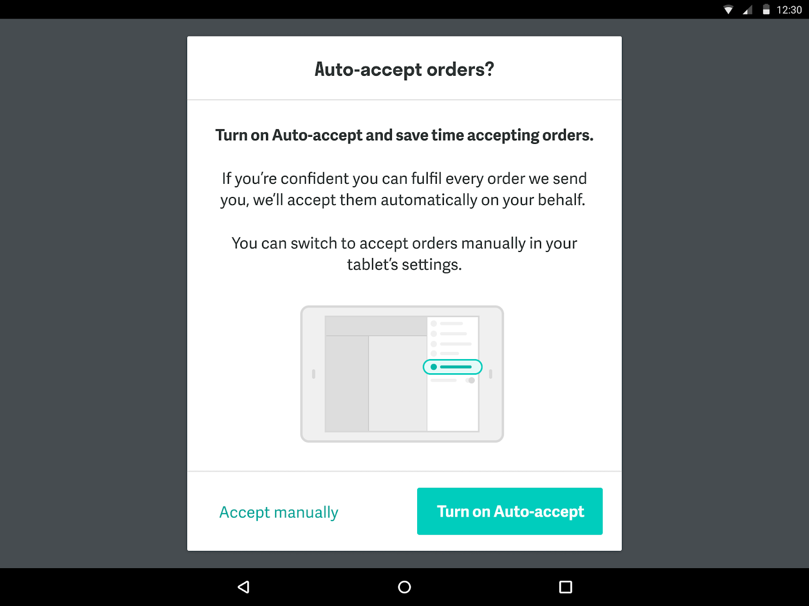
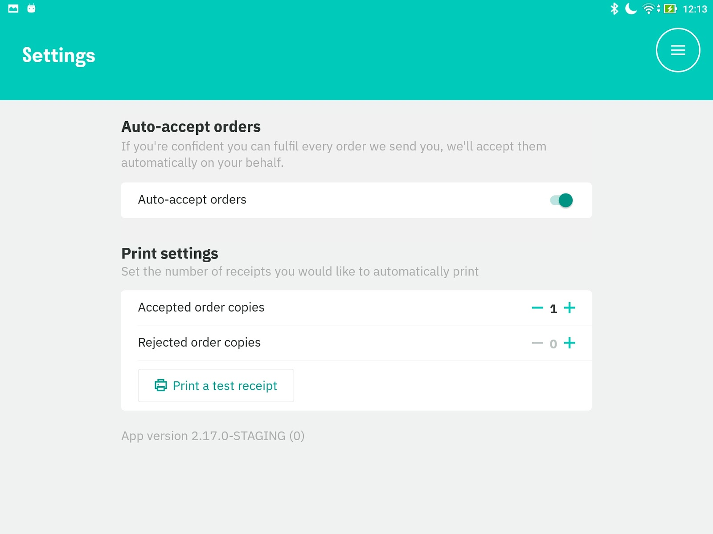

Si vous souhaitez laisser de côté la tablette Deliveroo pour libérer votre personnel de restaurant et éviter le risque de rejet de commandes, vous avez deux options disponibles.

## Configurer le mode sans tablette

La première option consiste à configurer l'intégration en mode sans tablette. Pour activer ce mode, contactez-nous à support@hubrise.com ou contactez votre responsable de compte Deliveroo.

Une fois activé, il n'est pas nécessaire de laisser la tablette Deliveroo allumée ou même d'en avoir une dans le restaurant.

Le mode sans tablette libère de l'espace sur votre plan de travail, ce qui est particulièrement utile si vous gérez plusieurs marques sur Deliveroo depuis la même cuisine. Il est également essentiel pour les cuisines fantômes.

## Activer l'acceptation automatique

La deuxième option consiste à activer l'auto-acceptation en sélectionnant **Activer l'auto-acceptation** sur votre tablette Deliveroo chaque jour lorsque vous ouvrez votre restaurant.

---

**REMARQUE IMPORTANTE :** Même si l'acceptation automatique est activée, vous devez garder la tablette allumée pour recevoir des commandes dans votre logiciel de caisse.

---

Vous pouvez également activer/désactiver l'acceptation automatique à tout moment depuis la page **Paramètres** sur la tablette.

Choisissez l'option qui convient le mieux aux besoins de votre restaurant pour optimiser votre processus de gestion des commandes.
