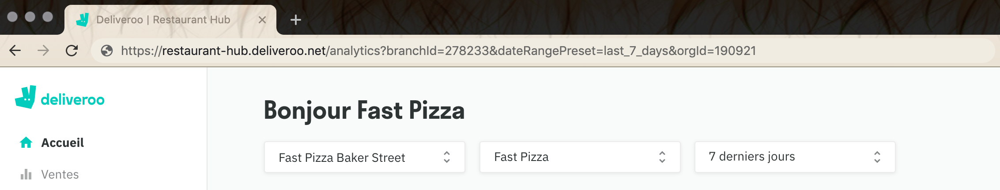

L'identifiant de restaurant est l'identificateur unique de votre restaurant Deliveroo. On parle également d'ID d'agence, ID administrateur, ID de tablette ou ID de point de vente, selon le contexte.

Pour trouver votre identifiant de restaurant Deliveroo, procédez comme suit :

## Option 1

À partir de votre tablette Deliveroo :

1. Sélectionnez le bouton de navigation en haut à droite de la page.
1. Votre identifiant est le numéro entre parenthèses indiqué en regard du nom du restaurant.

## Option 2

Dans votre navigateur :

1. Connectez-vous à votre [back-office Deliveroo](https://restaurant-hub.deliveroo.net/).
1. Accédez à l'onglet **Accueil**, puis sélectionnez le point de vente et le compte appropriés dans les menus déroulants.
1. Consultez l'adresse URL de la page et recherchez le paramètre intitulé `branchId`. Votre identifiant de restaurant Deliveroo est le numéro qui suit immédiatement le signe `=`. Si, par exemple, l'adresse URL est `https://restaurant-hub.deliveroo.net/analytics?branchId=278233&dateRangePreset=last_7_days&orgId=190921`, l'identifiant de restaurant Deliveroo est `278233`.

Si vous ne trouvez pas votre identifiant de restaurant, contactez votre gestionnaire de compte Deliveroo.
