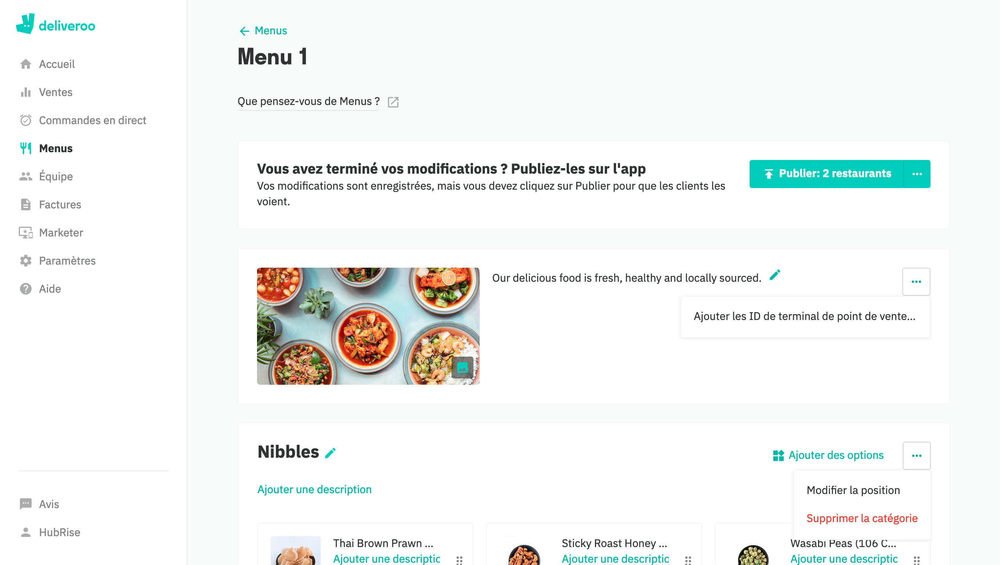
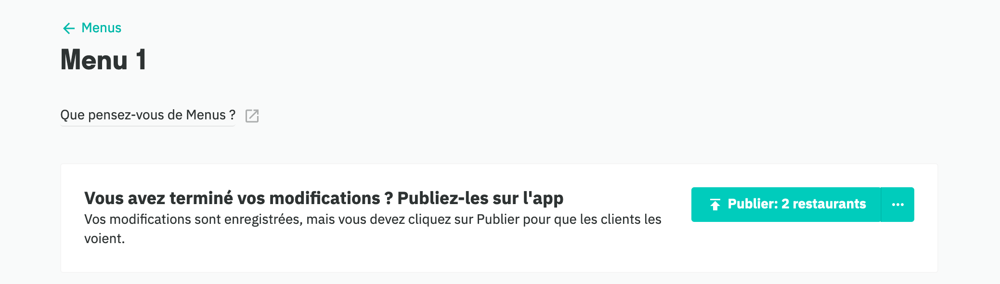

Pour que les commandes soient correctement traitées, la plupart des solutions sur EPOS exigent un code ref pour chaque produit. Lorsque vous créez votre menu sur Deliveroo, vous devez donc vous assurer que chaque produit est associé à un code ref correct.

---

**REMARQUE IMPORTANTE :** si vous n'attribuez pas de code ref à tous vos produits, Deliveroo ne traitera pas correctement la commande. Pour plus d'informations, voir la rubrique [Pourquoi mes commandes ne sont-elles pas reçues par HubRise ?](/apps/deliveroo/faqs/commandes-non-recues-code-ref-manquants).

---

Pour attribuer des codes ref à vos produits Deliveroo en passant par l'outil Gestionnaire de menu du back-office Deliveroo, procédez comme suit :

1. Connectez-vous à votre [back-office Deliveroo](https://restaurant-hub.deliveroo.net/).
1. Dans le menu de gauche, sélectionnez **Menus**.
1. Cliquez sur **Modifier le menu**. Si plusieurs menus existent, assurez-vous que celui que vous modifiez est le bon. 
1. Cliquez sur le symbole <InlineImage width="24" height="24"></InlineImage> en regard de la description du menu, puis sélectionnez **Ajouter des identifiants de point de vente (PLU)**. Assurez-vous de ne pas cliquer par inadvertance sur le bouton d'ellipse situé à côté d'une catégorie d'articles. 
1. Saisissez le code ref correct pour chaque produit de la liste. 
1. Cliquez sur **Enregistrer** pour confirmer le mappage.
1. Cliquez sur **Publier** pour finaliser votre mappage. Les modifications apportées au menu seront accessibles en ligne une fois qu'elles auront été publiées. 

---

**REMARQUE IMPORTANTE :** il n'est pas possible d'associer manuellement des codes ref avec des produits depuis l'outil Gestionnaire de menu de Deliveroo si votre compte Deliveroo est configuré pour mettre à jour les codes ref via l'API Menu. Pour passer à l'outil Gestionnaire de menu et afficher les champs de PLU dans votre back-office Deliveroo, veuillez contacter [support@deliveroo.co.uk](support@deliveroo.co.uk).

---
