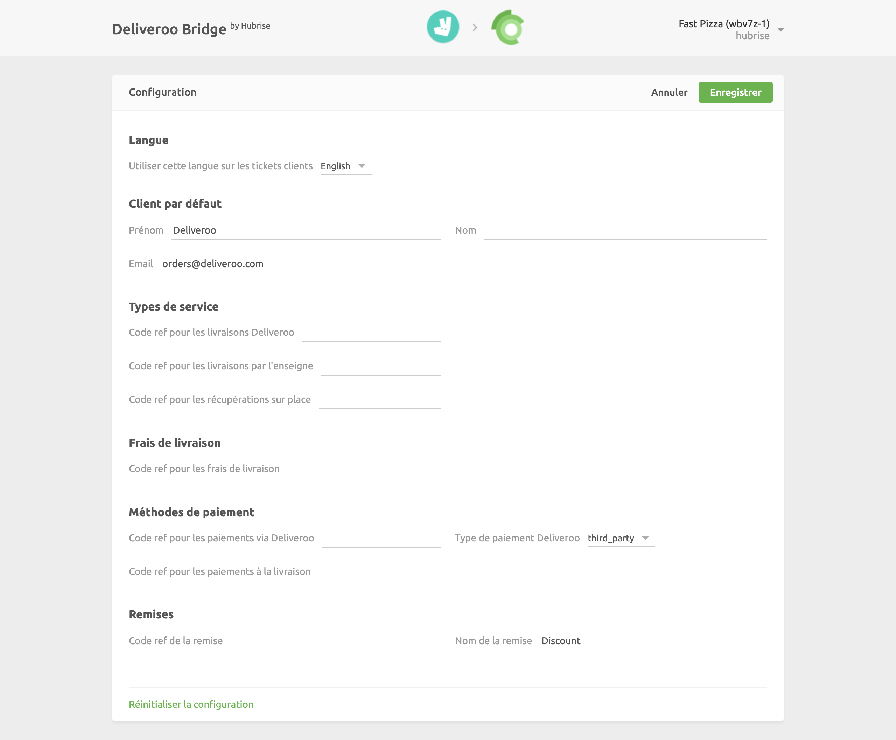

La page de configuration permet de personnaliser le comportement de Deliveroo Bridge. Elle est divisée en plusieurs sections pour faciliter la navigation.

## Langue

Dans cette section, vous pouvez choisir la langue d'édition de vos reçus.

## Types de service

Les types de service tels que la livraison par Deliveroo, la livraison par le restaurant ou la vente à emporter peuvent nécessiter la saisie du code ref correspondant. Reportez-vous à la documentation de votre solution d'encaissement sur le site Web de HubRise.

## Remises

Cette section permet de spécifier le code ref de la remise appliquée à vos produits, dans le cas où vous auriez une remise active sur Deliveroo. Pour obtenir le code ref correspondant, reportez-vous à la documentation de votre solution d'encaissement sur le site Web de HubRise.

Les promotions disponibles sur Deliveroo apparaissent sur la page **Toutes les offres** de votre back-office Deliveroo.

## Frais

Si des frais s'appliquent, un code ref peut être nécessaire. Reportez-vous à la documentation de votre solution d'encaissement sur le site Web de HubRise.

Dans cette section, vous pouvez spécifier le code ref des frais de livraison, ainsi que des suppléments appliqués aux commandes inférieures au prix minimum.

## Paiements

Les clients de Deliveroo peuvent régler leur commande en espèces lorsque le restaurant prend en charge la livraison.

Cette section de la page de configuration permet de spécifier les codes ref pour les paiements en ligne et en espèces. Pour connaître les codes à utiliser, consultez la documentation de votre solution d'encaissement sur le site Web de HubRise.

## Sauvegarde de la configuration

Lorsque vous êtes satisfait de la configuration de Deliveroo Bridge, cliquez sur **Enregistrer** en haut de la page pour revenir à la page Opérations.

## Réinitialisation de la configuration

Si vous souhaitez réinitialiser la configuration et effacer ses valeurs, cliquez sur **Réinitialiser la configuration** en bas de la page.

---

**REMARQUE IMPORTANTE :** La réinitialisation de la configuration effacera également votre identifiant de restaurant Deliveroo. Pour recevoir à nouveau les commandes Deliveroo, vous devrez resaisir votre identifiant de restaurant.

---

La réinitialisation de la configuration ne supprime pas les fichiers journaux des opérations affichés sur la page principale.
