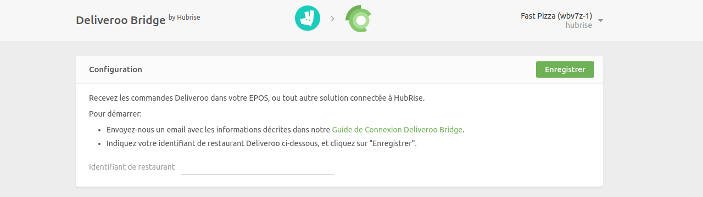

La connexion de Deliveroo à HubRise s'effectue en quelques étapes.

---

**REMARQUE IMPORTANTE :** Si vous ne possédez pas encore de compte HubRise, commencez par en ouvrir un sur la [page d'inscription à HubRise](https://manager.hubrise.com/signup). L'inscription ne prend que quelques minutes !

---

## 1. Activez HubRise sur Deliveroo

Dans un premier temps, l'intégration de HubRise doit être activée sur votre compte Deliveroo.

Contactez-nous par e-mail à l'adresse [support@hubrise.com](mailto:support@hubrise.com) en précisant les informations suivantes :

- L'adresse URL du restaurant Deliveroo que vous souhaitez connecter. Exemple : [https://deliveroo.fr/en/menu/nice/jean-medecin/sushi-shop-nice-1](https://deliveroo.fr/en/menu/nice/jean-medecin/sushi-shop-nice-1).
- L'identifiant de restaurant Deliveroo de votre magasin. Pour plus de détails, reportez-vous à notre FAQ : [Comment trouver mon identifiant de restaurant Deliveroo](/apps/deliveroo/faqs/trouver-mon-identifiant-de-restaurant-deliveroo).
- L'adresse e-mail avec laquelle vous vous connectez au back-office de Deliveroo.
- L'adresse e-mail de votre gestionnaire de compte Deliveroo.
- Le nom et l'identifiant de votre point de vente HubRise. Exemple : `Sushi Shop Colbert z6q31-0`.
- Le type de service pris en charge par Deliveroo pour votre restaurant. Pour une description des types de services Deliveroo, reportez-vous à notre page [Terminologie](/apps/deliveroo/terminologie#types-de-service).

Avec ces informations, l'équipe d'intégration de Deliveroo pourra activer la connexion HubRise de votre magasin. Les nouvelles connexions sont approuvées les mardis et les jeudis uniquement.

---

**REMARQUE IMPORTANTE :** Si des codes ref de produits sont manquants, Deliveroo n'activera pas la connexion HubRise. Pour plus de détails, voir la page [Associer les codes ref](/apps/deliveroo/associer-codes-ref/).

---

## 2. Connectez Deliveroo Bridge

---

**REMARQUE IMPORTANTE :** Deliveroo Bridge se connecte à HubRise au niveau du point de vente. Pour plus d'informations, voir la page [Points de vente (en anglais)](/docs/locations/).

---

Pour connecter Deliveroo Bridge à HubRise, procédez comme suit :

1. Connectez-vous à votre compte HubRise.
1. Sélectionnez le point de vente que vous souhaitez connecter dans le menu déroulant.
1. Sélectionnez **CONNEXIONS**, puis **Voir les apps disponibles**.
1. Dans la liste des apps, sélectionnez **Deliveroo Bridge**.
1. Cliquez sur **Connecter**.
1. Cliquez sur **Autoriser** pour donner à Deliveroo Bridge l'accès aux données HubRise de votre restaurant. Si votre compte possède plusieurs points de vente, développez **Tous les points de vente**, choisissez le point de vente à connecter, puis cliquez sur **Autoriser**.
1. Une nouvelle page vous demande d'indiquer votre identifiant de restaurant Deliveroo. Entrez l'identifiant, puis cliquez sur **Enregistrer** pour terminer le processus de connexion.

## 3. Configurez vos préférences

Une fois la connexion effectuée, vous devez renseigner quelques paramètres sur la page Configuration afin que les commandes soient transmises correctement à votre solution d'encaissement.

Pour plus d'informations sur la page Configuration et la manière d'y accéder, voir la rubrique [Interface utilisateur](/apps/deliveroo/interface-utilisateur/#page-de-configuration). Pour plus de détails sur la configuration des paramètres de Deliveroo Bridge, voir la rubrique [Configuration](/apps/deliveroo/configuration).

## 4. Renseigner les codes ref des produits

Si vous utilisez Deliveroo avec une solution d'encaissement, vous devez renseigner les codes ref de tous les produits de votre menu Deliveroo. Vous permettrez ainsi à votre solution d'encaissement d'identifier correctement chaque article.

Pour savoir comment associer les codes ref sur Deliveroo, voir la rubrique [Associer les codes ref](/apps/deliveroo/associer-codes-ref).
