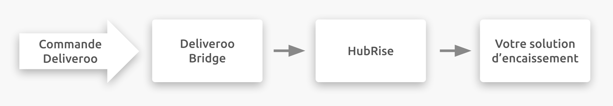

## Description

Deliveroo est une plateforme de commande en ligne et de livraison destinée aux restaurants et aux commerces de proximité. Elle est basée au Royaume-Uni, mais opère dans 13 pays différents en Europe, en Asie et en Océanie.

Les restaurants et les commerces de proximité peuvent profiter de la vaste clientèle de Deliveroo pour développer leur activité et trouver de nouveaux clients. Ils peuvent ainsi se concentrer sur ce qu'ils font le mieux (préparer des aliments, vendre des produits d'épicerie, etc.) tandis que Deliveroo s'occupe de la solution de commande en ligne et du marketing associé, ainsi que de la logistique.

## Fonctionnalités de l'intégration

Deliveroo se connecte à votre compte HubRise via Deliveroo Bridge, une application développée par HubRise.

Deliveroo Bridge permet de :

- Recevoir les commandes Deliveroo dans HubRise.
- Recevoir les informations de livraison dans HubRise, lorsque les commandes sont livrées par votre personnel.

---

**REMARQUE IMPORTANTE :** le catalogue et la disponibilité des produits ne peuvent pas encore être synchronisés, mais HubRise prévoit de mettre en place cette fonctionnalité courant 2021.

---

## Pourquoi se connecter ?

Le fait de connecter votre restaurant en ligne ou votre magasin de proximité Deliveroo à HubRise vous permet de recevoir vos commandes Deliveroo directement dans votre solution d'encaissement ou sur l'écran cuisine connecté à HubRise. Vous pouvez ainsi gérer les commandes Deliveroo dans votre logiciel habituel. Les commandes Deliveroo transiteront par votre installation existante, comme vos autres commandes.

## Prérequis

Pour permettre la connexion entre Deliveroo et HubRise, votre restaurant doit être partenaire de Deliveroo.
