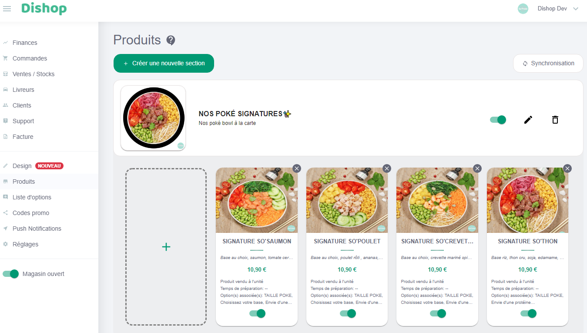
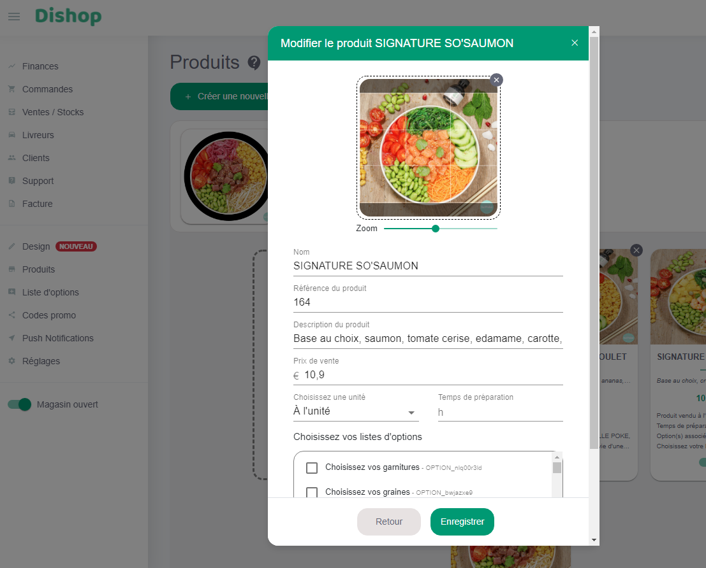
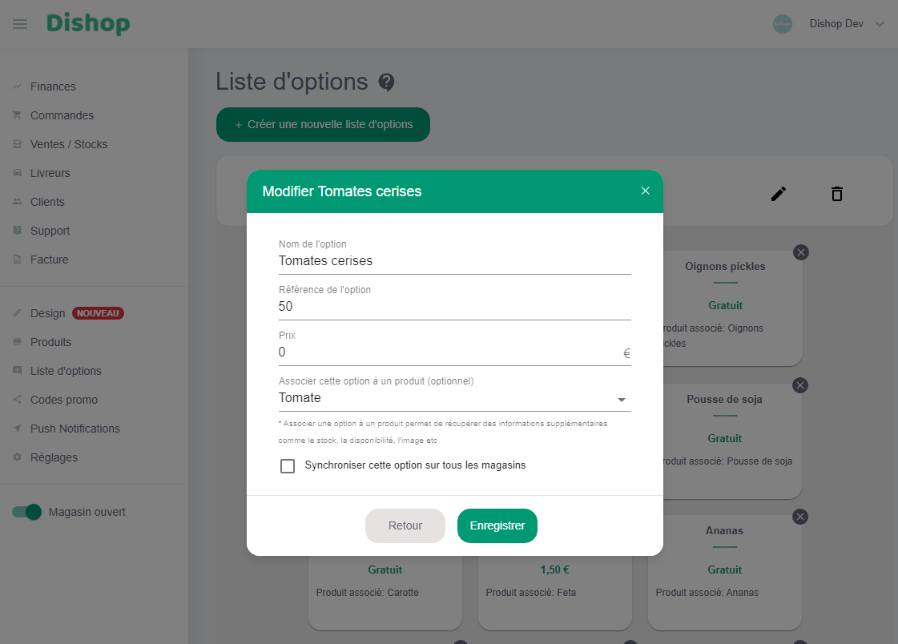
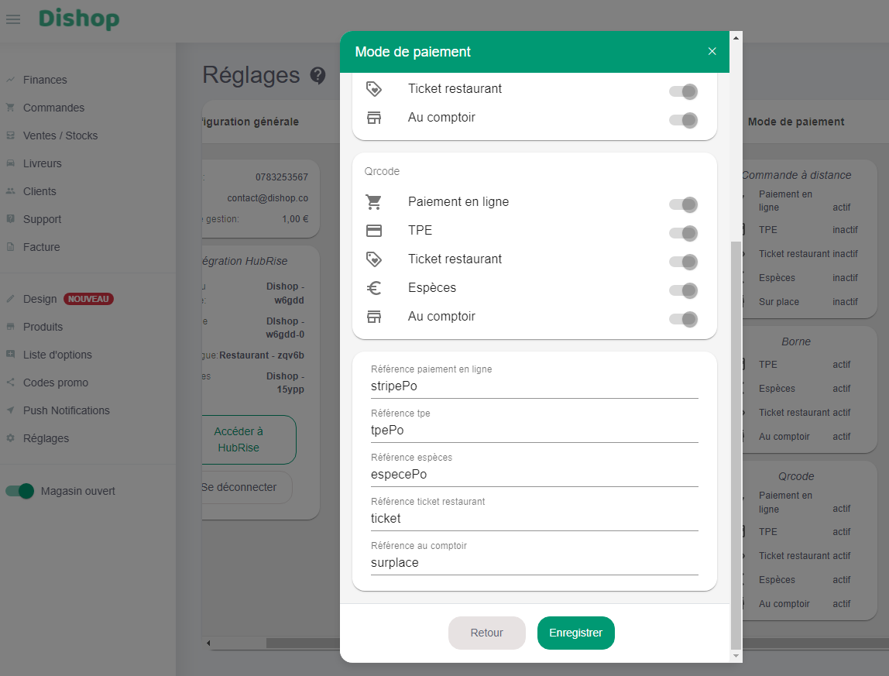

## Produits

Pour modifier le code ref d'un produit, suivez ces étapes :

1. Depuis le back office Dishop, dans le menu de gauche, sélectionnez **Produits**.
1. Cliquez sur la section à laquelle le produit appartient, puis sur le produit à éditer. Le code ref du produit s'affiche dans le champ **Référence du produit**.
   
   
1. Modifiez le code ref du produit et cliquez sur le bouton **Enregistrer** pour sauvegarder.

## SKUs

Les SKUs sont uniquement supportées lorsque les menus sont importés depuis HubRise. Dans ce cas, toutes les SKUs d'un produit sont ajoutées à une même liste d'options. Le code ref est celui de la première option.

Pour les menus édités manuellement, Dishop recommande d'utiliser des options pour les tailles.

Pour modifier le code ref d'une SKU, suivez les étapes de la section [Options](#options).

## Options

Pour modifier le code ref d'une option, suivez ces étapes :

1. Depuis le back office Dishop, dans le menu de gauche, sélectionnez **Liste d'options**.
1. Cliquez sur une liste d'options, puis sur une option. Le code ref se trouve dans le champ **Référence de l'option**.
   
1. Modifiez le code ref de l'option et cliquez sur le bouton **Enregistrer** pour sauvegarder.

## Promotions

Les promotions dans HubRise sont les offres spéciales qui s'appliquent à certains articles. Dishop ne supporte pas les promotions sur les articles.

Dans certains cas, vous pouvez néanmoins utiliser des produits avec options pour les promotions, par exemple dans le cas de menus à prix fixe. Pour modifier le code ref, suivez alors les étapes de la section produit [Produits](#produits).

## Remises

Les remises dans HubRise sont les offres spéciales qui s'appliquent à l'ensemble de la commande. Elles correspondent aux codes promotionnels dans Dishop.

Pour modifier le code ref d'un code promotionnel, suivez ces étapes :

1. Depuis le back office Dishop, dans le menu de gauche, sélectionnez **Codes promo**.
1. Cliquez sur un code promotionnel. Le code ref s'affiche dans le champ **Référence du code promo**.
   
1. Modifiez le code ref du code promotionnel et cliquez sur le bouton **Enregistrer** pour sauvegarder.

## Méthodes de paiement

Les méthodes de paiement dans HubRise correspondent aux modes de paiement dans Dishop. Selon les apps connectées à Dishop, les modes de paiement peuvent nécessiter un code ref. Référez-vous à la documentation des apps connectées sur le site de HubRise pour vérifier.

Pour ajouter un code ref à un mode de paiement, suivez ces étapes :

1. Depuis le back office Dishop, dans le menu de gauche, cliquez sur **Réglages**.
1. Sous **Mode de paiement**, cliquez sur l'un des encarts **Commande à distance**, **Borne** ou **Qrcode**.
1. Faites défiler l'encart vers le bas. Les codes ref se trouvent dans les champs **Référence paiement en ligne**, **Référence tpe**, **Référence espèces**, **Référence ticket restaurant** et **Référence au comptoir**.
   
1. Modifiez le code ref et cliquez sur le bouton **Enregistrer** pour sauvegarder.

## Types de service

Les types de service tels que livraison, à emporter ou sur place, correspondent aux modes de vente dans Dishop. Selon les apps connectées à Dishop, les modes de vente peuvent nécessiter un code ref. Référez-vous à la documentation des apps connectées sur le site de HubRise pour vérifier.

Pour ajouter un code ref à un mode de vente, suivez ces étapes :

1. Depuis le back office Dishop, dans le menu de gauche, cliquez sur **Réglages**.
1. Sous **Mode de vente**, cliquez sur l'un des encarts **Commande à distance**, **Borne** ou **Qrcode**. Les codes ref se trouvent dans les champs **Référence du mode tout**, **Référence du mode livraison**, **Référence du mode emporter** et **Référence du mode sur place**.
   
1. Modifiez le code ref et cliquez sur le bouton **Enregistrer** pour sauvegarder.
