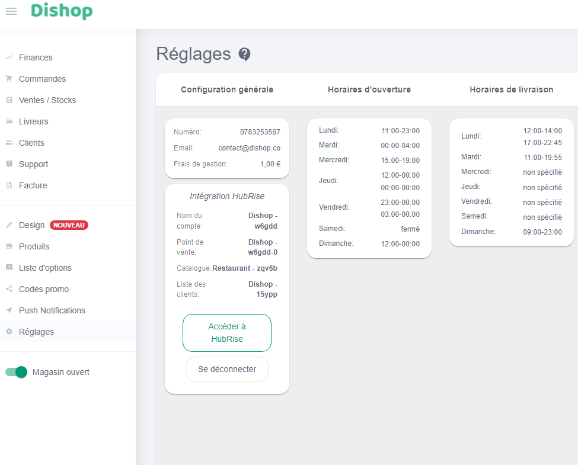

---

**REMARQUE IMPORTANTE :** Si vous ne possédez pas encore de compte HubRise, commencez par en ouvrir un sur la [page d'inscription à HubRise](https://manager.hubrise.com/signup). L'inscription ne prend que quelques minutes !

---

## Connecter Dishop

Pour établir la connexion entre Dishop et HubRise :

1. Ouvrez le back office Dishop.
2. Dans le menu à gauche, cliquez sur **Réglages**.
   
3. Sous **Configuration générale**, dans la section **Intégration HubRise**, cliquez sur le bouton **Se connecter**. La page HubRise s'ouvre dans votre navigateur.
4. Si vous avez plusieurs points de vente, choisissez le point de vente à connecter. Si le point de vente sélectionné possède plusieurs listes de clients ou catalogues, cliquez sur **Suivant** pour afficher les listes déroulantes correspondantes, puis sélectionnez les options voulues.
5. Cliquez sur **Autoriser**.

## Déconnecter Dishop

Pour déconnecter Dishop de HubRise, suivez ces étapes :

1. Ouvrez le back office Dishop.
2. Dans le menu à gauche, cliquez sur **Réglages**.
   
3. Sous **Configuration générale**, cliquez sur le bouton **Se déconnecter**.
