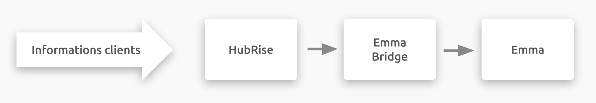

---

**REMARQUE IMPORTANTE :** Une documentation complète de cette intégration sera bientôt disponible.

---

## Description

Emma est une solution d'envoi d'e-mails et de newsletters personnalisés, avec support à la stratégie et à la conception de la campagne marketing.

Emma permet d'automatiser l'envoi de vos e-mails, de personnaliser leur apparence avec du contenu dynamique, ou encore de tester le contenu le plus pertinent en envoyant une version différente d'un e-mail à une partie de votre audience.

Emma propose un éditeur simple d'utilisation, qui permet de personnaliser vos templates d'e-mails, et de créer une page d'accueil liée à vos e-mails.

## Fonctionnalités de l'intégration

Connecter Emma à HubRise permet à votre solution de marketing de :

- Recevoir les informations clients de HubRise.

Emma peut être connecté à HubRise depuis le back-office de HubRise.

## Pourquoi se connecter ?

En connectant Emma à HubRise, vous permettez à votre solution de marketing de communiquer avec les autres applications que vous utilisez de manière quotidienne. Recevez les informations clients provenant de votre solution de commande en ligne, ou des plateformes de livraison de repas sur votre solution de marketing.

Grâce à HubRise, vous pouvez synchroniser votre menu, vos informations clients et vos commandes avec votre solution d'encaissement, de commande en ligne, les plateformes de livraison de repas (dont Deliveroo, Uber Eats et Just Eat), les solutions de gestion de livreurs ou de services de livraison, les solutions eMarketing (SMS / eMailing), business intelligence, systèmes de gestion de stock et de fidélisation client, et bien d'autres encore. Le nombre d'applications compatibles augmente chaque mois. Pour voir les applications que vous pouvez connecter, consultez notre [page Apps](/apps).

## Prérequis

Pour établir la connexion entre Emma et HubRise, vous devez posséder un compte Emma.
