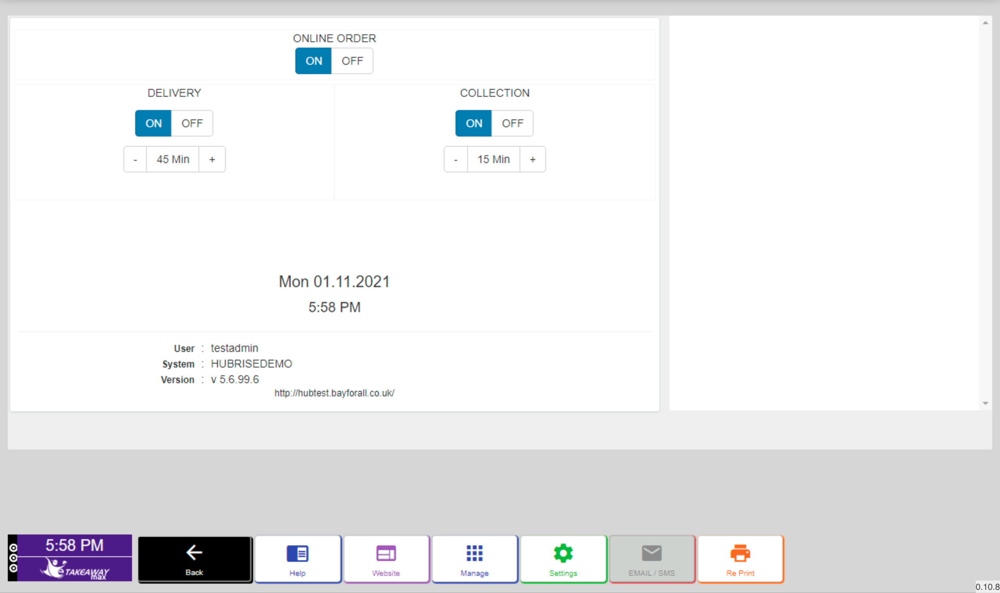
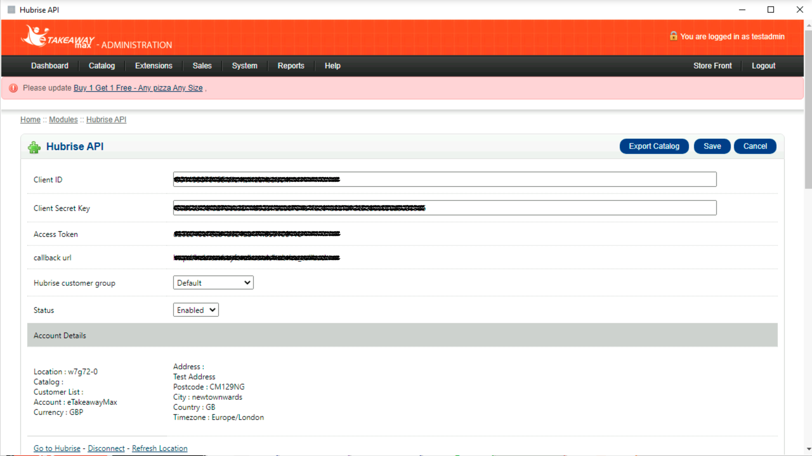
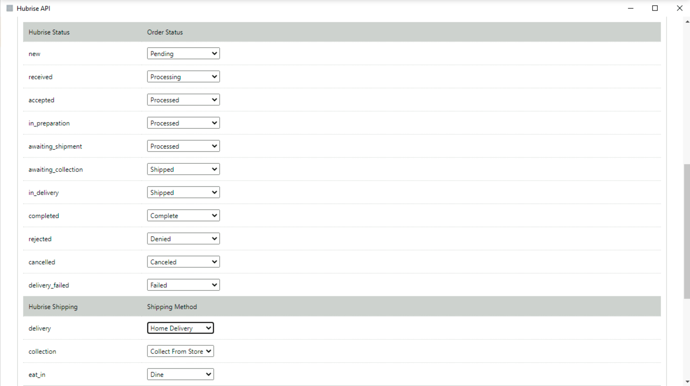

The HubRise configuration page on eTakeaway Max allows you to customise your connection with HubRise.
You can choose how to map eTakeaway Max order statuses, service types, and payment methods to HubRise.

---

**IMPORTANT NOTE:** eTakeaway Max supports two types of back office users: system administrator and store manager.
Only system administrators can access the HubRise configuration page.

---

To access the HubRise configuration page, follow these steps:

1. Log in to your eTakeaway Max back office with your administrator account.
1. From the main dashboard, click the **Manage** button.
   
   
1. From the management screen, click the **Manage** button at the bottom. You will be redirected to the configuration dashboard.
   

1. From the configuration dashboard, select **Extensions > Modules** from the top menu.
   

1. From the list of modules, select **Edit** next to **HubRise API**.
   

1. In the HubRise API module, scroll down to find the orders statuses, service types, and payment methods configurations.
   

You can now configure how order statuses, service types, and payment methods are mapped to HubRise by changing the values in the dropdown menus.