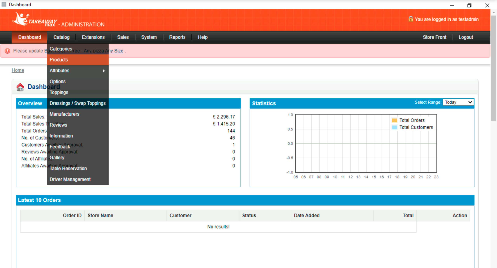
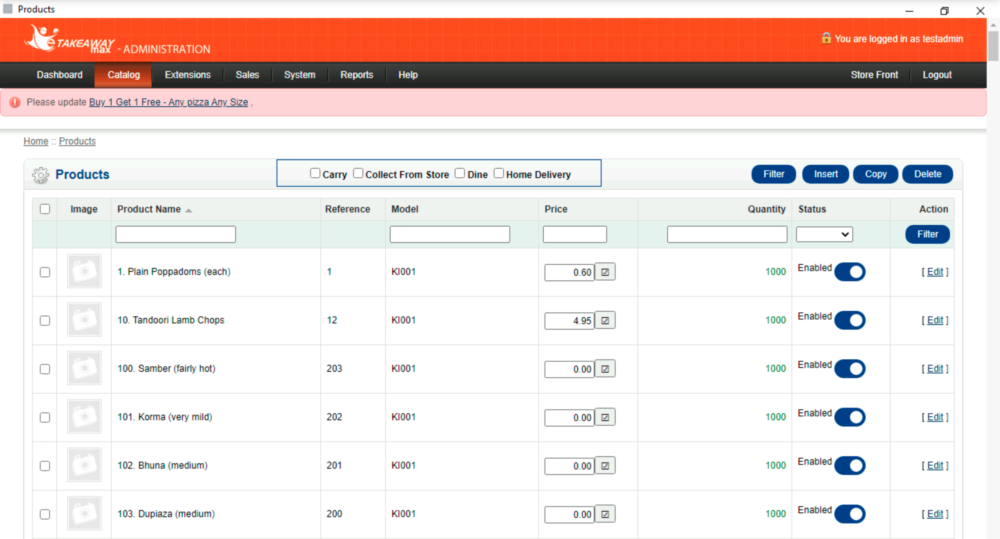

eTakeaway Max expects all incoming orders to contain specific ref codes for each sku, option, deal, discount, charge, service type, and payment present. You must ensure that all connected apps use the correct ref codes if you want your orders to be correctly processed. 

This page explains how to find the ref codes in the eTakeaway Max back office.

Some connected apps offer the ability to import the catalog directly from HubRise, and therefore to autopopulate the ref codes. To learn how to export your eTakeaway Max catalog to HubRise, see [Pushing the Catalog](/apps/etakeaway-max/pushing-catalog).

## Finding Ref Codes For Individual Items

Depending on your account type, you need to use different procedures to find the ref codes for your items.

### System Administrators

If you use a system administrator account, follow these steps:

1. Log in to your eTakeaway Max back office with your administrator account.
1. From the main dashboard, click the **Manage** button.
   
   
1. From the management screen, click the **Manage** button at the bottom. You will be redirected to the configuration dashboard.
   

1. From the configuration dashboard, select **Catalog > Products** from the top menu.
   

1. From the list of products, see the **Reference** column to find the ref codes for your products.
   

### Store Managers

If you use a store manager account, follow these steps:

1. Log in to your eTakeaway Max back office with your store manager account.
1. From the main dashboard, select **Menu > Products**.
   

1. From the list of products, see the **Reference** column to find the ref codes for your products.
   
