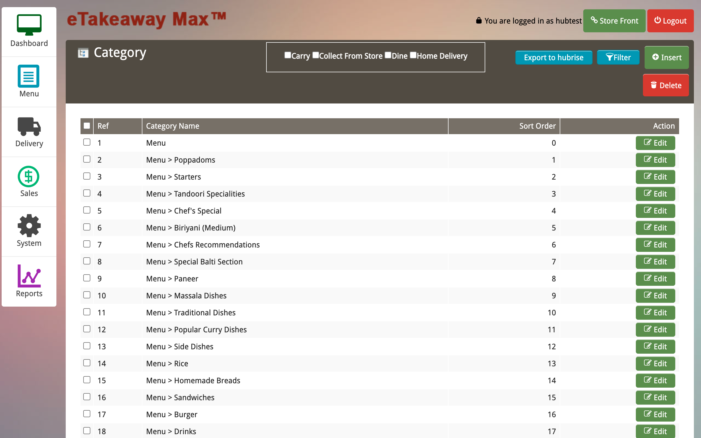

This page describes how to export your eTakeaway Max catalog and what information is sent to HubRise.

## Exporting The Catalog To HubRise

To export your catalog to HubRise, follow these steps:

1. From the main dashboard, select **Menu > Categories**.
2. From the **Categories** page, click **Export to HubRise**.
   

---

**IMPORTANT NOTE**: This operation will replace your current HubRise catalog.

---

Depending on how large your catalog is, it might take a few minutes for your HubRise catalog to be fully updated.

## Information Sent to HubRise

The following sections provide more details on how your eTakeaway Max catalog is mapped to HubRise.

### Categories

The categories in the eTakeaway Max catalog are mapped one-to-one to categories of products on HubRise.

eTakeaway Max sends to HubRise the category name, ref code, and description.

### Products and Skus

eTakeaway Max does not support products with skus. For every item in the catalog, eTakeaway Max creates a product with a single sku in HubRise with the following information (if available):

- Sku name
- Sku ref code
- Description
- Images
- Price
- Options

### Options

eTakeaway Max supports single and multiple option groups. Options are associated with a non-customisable ref code.

### Deals

eTakeaway Max supports deals and sends this information to HubRise. Deals are associated with a ref code, and each deal line is attached to a label.

## Technical Reference

The following sections provide technical details on how your eTakeaway Max catalog is encoded in HubRise.

### Categories

For every category, the following fields are sent to HubRise:

- `name`: The name of the category.
- `ref`: The category ref code.
- `description`: The category description.

### Skus

For every sku, eTakeaway Max sends the following information to HubRise:

- `name`: The name of the sku.
- `description`: The description of the sku.
- `image_ids`: The list of image IDs associated with the sku.
- `skus`: A list containing a single sku.
  - `skus[0].ref`: The ref code of the sku, which will be passed along in orders.
  - `skus[0].price`: The price of the sku.
  - `skus[0].option_list_refs`: The list of options attached to the sku.

### Options

For every option, the following information is sent to HubRise:

- `name`: The name of the option.
- `price`: The price of the option.
- `ref`: The ref code of the option.

### Deals

For every option, the following information is sent to HubRise:

- `name`: The name of the deal.
- `description`: The description of the deal.
- `ref`: The ref code of the deal.
- `lines`: The product lines included in the deal.

Each product line contains the `label`, `pricing_effect`, and `skus` fields.
For more information about HubRise deals, see [Deals](/developers/api/catalog-management#deal-in-catalog-upload).
