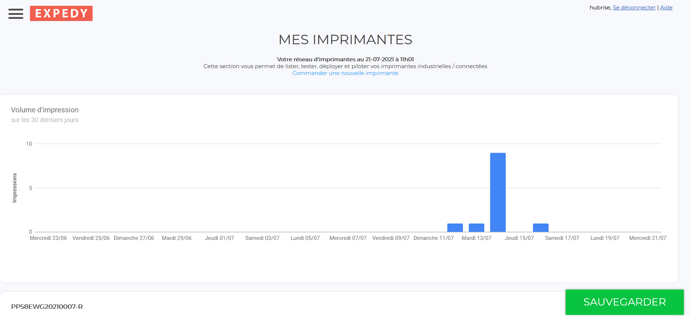
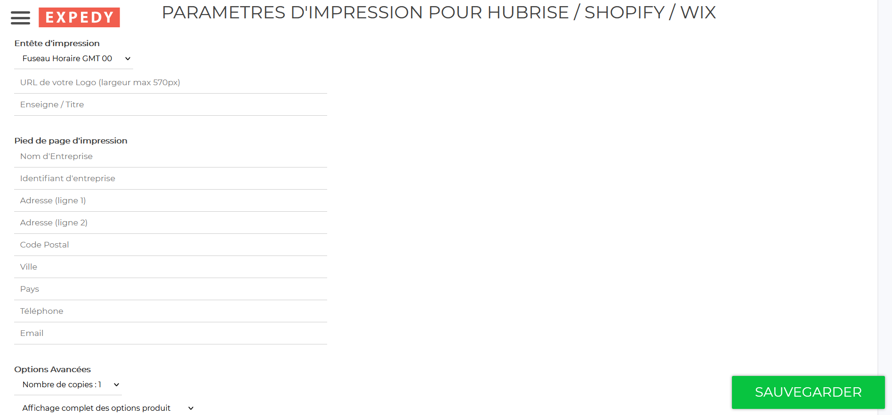

Le back-office de Expedy permet de visualiser et de configurer les paramètres d'impression.

## Statut des dernières impressions

Lorsque votre imprimante est sous tension, les commandes HubRise sont imprimées dès réception, ou selon votre configuration, dès qu'elles passent dans un statut qui déclenche l'impression.

Si votre imprimante est hors tension, les commandes sont mises en attente jusqu'à la prochaine mise sous tension.

Expedy permet de visualiser le volume d'impression en 30 jours, ainsi que les détails des 10 dernières commandes reçues. Pour y accéder, suivez les étapes suivantes :

1. Depuis la page d'accueil de votre back-office Expedy, cliquez sur **Imprimantes**.
1. Cliquez sur le nom de l'imprimante concernée.
   

## Paramètres HubRise

Expedy permet de sélectionner le statut de commande qui déclenche l'impression. Vous pouvez ainsi choisir d'imprimer les commandes lorsqu'elles passent dans l'un des 3 statuts suivants :

- _Nouvelle_
- _Reçue_
- _Acceptée_

Expedy permet aussi d'effectuer une action supplémentaire lors de la réception d'une commande. Vous pouvez ainsi choisir de passer la commande en :

- _Reçue_
- _Acceptée_

Pour paramétrer ces actions, suivez les étapes suivantes :

1. Depuis la page d'accueil de votre back-office Expedy, cliquez sur **Imprimantes**.
1. Cliquez sur le nom de l'imprimante concernée.
1. Faites défiler vers le bas jusqu'à la section **HubRise**.
   

## Paramètres d'impression

Vous pouvez configurer le nom et le logo de votre société en tête des tickets. Vous pouvez également afficher l'adresse complète de votre établissement en pied de page.

Pour configurer la mise en page des tickets, suivez les étapes suivantes :

1. Depuis la page d'accueil de votre back-office Expedy, cliquez sur **Imprimantes**.
1. Cliquez sur le nom de l'imprimante concernée.
1. Faites défiler vers le bas jusqu'à la section **PARAMETRES D'IMPRESSION POUR HUBRISE / SHOPIFY / WIX**.
   
