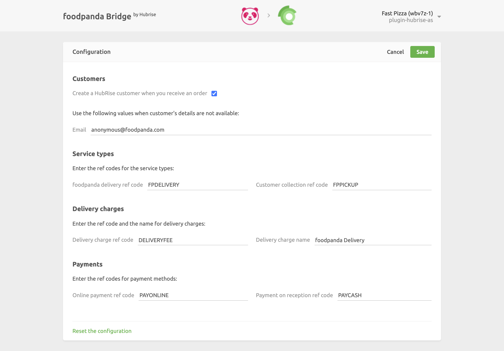

The configuration page allows you to customise the behaviour of the foodpanda Bridge based on your preferences.
These are divided into different categories for an easier navigation.

## Customers

foodpanda does not share the customer's email address with the connected solutions. For this reason, the email address will always be `orders@foodpanda.com`. However, the name and phone number of the client are always present.

If you want to save the customers' details on HubRise, select the **Create a HubRise customer when you receive an order** checkbox. Otherwise, if you prefer to use guest orders to avoid polluting your database with incomplete information, leave the checkbox unselected.

This section allows also to specify the email address that will be used for all your foodpanda orders. Enter the default email address in the **Email** field.

## Service Types

This section allows you to specify the ref codes used for foodpanda delivery and takeaway. Refer to your EPOS documentation on the HubRise website to verify the correct values to enter.

## Charges

If delivery charges apply, a ref code might be required. Refer to your EPOS documentation on the HubRise website to verify which value you should enter in the **Delivery charge ref code** field.

## Payments

foodpanda customers can pay their orders either online or by cash on delivery.

This section of the Configuration page allows you to specify the ref codes for these two payment methods. Refer to your EPOS documentation on the HubRise website to verify the correct values to enter.

## Save the Configuration

Once you are happy with the configuration of the foodpanda Bridge, click **Save** at the top of the page to continue to the main page.

## Reset the Configuration

You can always restore the Configuration page to its default values and change the foodpanda location ID associated with your HubRise location by clicking on **Reset the configuration** at the bottom of the page.

Resetting the configuration does not remove the operation logs displayed in the main page.
