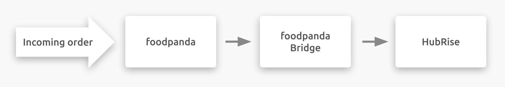

## Description

foodpanda is an online ordering and food delivery platform part of the Delivery Hero network.
It is present in several countries in Asia, and in Bulgaria and Romania in Europe.

Restaurants can benefit from foodpanda's large pool of customers to grow their business and find new clients.
At the same time, they can concentrate on what they do best (preparing food) while letting foodpanda take care of the logistics of food delivery.

## Integration Features

foodpanda connects to your HubRise account through foodpanda Bridge, an app developed by HubRise.

Connecting foodpanda Bridge allows foodpanda to:

- Push orders to HubRise. 
- Push delivery information to HubRise, for orders delivered by your team.

---

**IMPORTANT NOTE:** Product catalog and product availability cannot currently be synchronised, but HubRise is planning to release this feature in 2021.

---

## Why Connect?

Connecting your foodpanda online restaurant or convenience store to HubRise allows you to receive foodpanda orders directly in your EPOS or Kitchen Display Screen also connected with HubRise.
You will be able to manage foodpanda orders alongside other orders, using your own tools. foodpanda orders will flow through your existing setup, as all other orders already do.

## Prerequisites

To establish a connection between foodpanda and HubRise, your restaurant must be a foodpanda partner.
