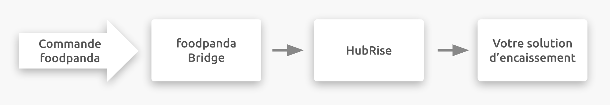

---

**REMARQUE IMPORTANTE :** La documentation complète est disponible <Link to="/apps/foodpanda" addLocalePrefix={false}>en anglais uniquement</Link>.

---

## Description

foodpanda est une plateforme de commande et de livraison de repas en ligne qui fait partie du réseau Delivery Hero. L'entreprise est présente dans plusieurs pays d'Asie, ainsi qu'en Bulgarie et en Roumanie.

foodpanda se connecte à votre compte HubRise par le biais de l'application foodpanda Bridge développée par HubRise.

## Fonctionnalités de l'intégration

La connexion avec foodpanda Bridge permet à foodpanda de :

- Envoyer les commandes à HubRise, y compris le statut des commandes.
- Recevoir les informations de livraison dans HubRise, lorsque les commandes sont livrées par votre personnel.

---

**REMARQUE IMPORTANTE :** Le catalogue et la disponibilité des produits ne peuvent pas encore être synchronisés, mais HubRise prévoit de mettre en place cette fonctionnalité en 2022.

---

foodpanda Bridge peut être connecté à HubRise depuis le back-office de HubRise.

## Pourquoi se connecter ?

Le fait de connecter votre restaurant en ligne ou votre magasin de proximité foodpanda à HubRise vous permet de recevoir vos commandes foodpanda directement dans votre solution d'encaissement ou sur votre système d'écran de cuisine connecté à HubRise. Vous pouvez gérer les commandes foodpanda parallèlement à vos autres commandes en utilisant vos propres outils. Les commandes foodpanda transitent par votre configuration existante, de même que toutes vos autres commandes.

Avec HubRise, synchronisez votre menu, vos informations clients et vos commandes avec votre solution de commande en ligne, les plateformes de livraison de repas (dont Deliveroo, Uber Eats et Just Eat), les solutions de gestion de livreurs ou de services de livraison, les solutions d'e-marketing (SMS/e-mailing) et de business intelligence, les systèmes de gestion de stock et de fidélisation client, et bien d'autres encore. Le nombre d'applications compatibles augmente chaque mois. Pour voir les applications que vous pouvez connecter, consultez notre [page Apps](/apps).

## Prérequis

Pour permettre la connexion entre foodpanda et HubRise, votre restaurant doit être partenaire de foodpanda.
