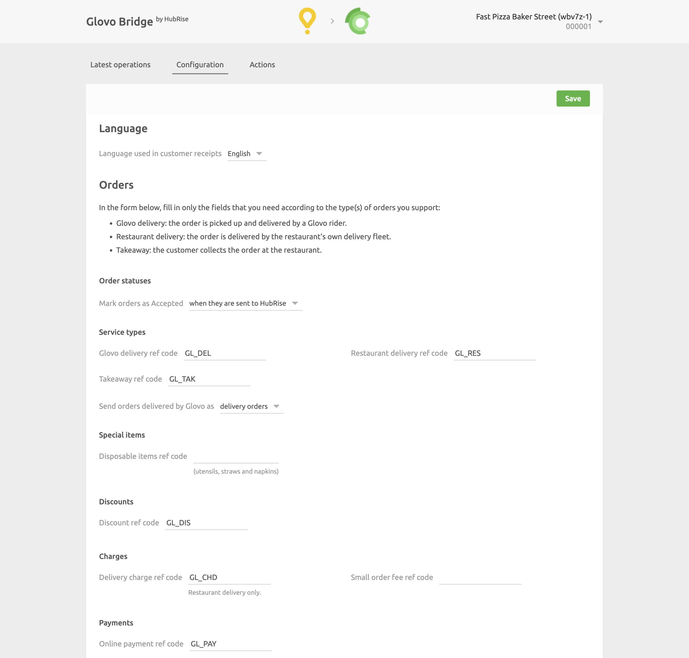
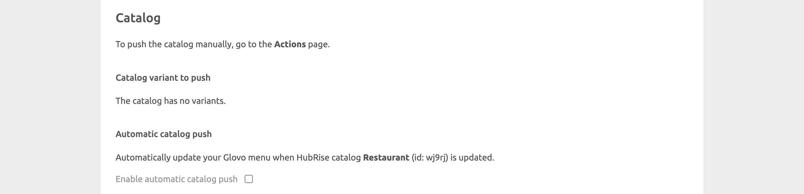
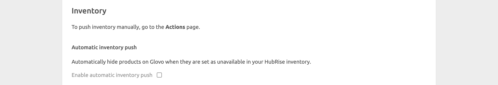

The configuration page lets you customise the behaviour of Glovo Bridge based on your preferences.
These are divided into different sections for an easier navigation.

## Language

Choose the language to use for generic items such as `Delivery charge`. These names may appear in your EPOS and in customer receipts.

## Orders

### Order Statuses

From the dropdown menu, select the HubRise status that makes the order accepted in Glovo.
Refer to your EPOS documentation on the HubRise website to verify your EPOS requirements.

### Service Types

Service types such as delivery by Glovo, restaurant delivery or takeaway might require the corresponding ref code entry. Refer to your EPOS documentation on the HubRise website to verify.

Additionally, from this section you can choose to mark Glovo orders as delivery orders or collection orders. This is useful if you have specific business requirements for financial reporting.

### Special Items

This section lets you specify a ref code to apply when customers request cutlery during checkout.

### Discounts

This section lets you specify the discount ref code applied to your products, in case you have one active on your Glovo page. Refer to your EPOS documentation on the HubRise website to see how to obtain the corresponding ref code.

### Charges

If charges apply, a ref code might be required. Refer to your EPOS documentation on the HubRise website to verify.

In this section, you can specify the ref code for delivery charges, and for surcharges applied to orders below the minimum price.

### Payments

Glovo customers can pay for their order either online or by cash.

This section of the configuration page lets you specify the ref code for online payment methods. Refer to your EPOS documentation on the HubRise website to verify the correct code to use.

## Catalog {#catalog}

If your catalog has multiple variants, this section lets you select which variant you can push to Glovo.

Additionally, choose if you want to push your HubRise catalog to Glovo every time it is updated on HubRise by selecting the **Enable automatic catalog push** checkbox.
By default, this option is turned off.

## Inventory

You can push inventory data into Glovo from the **Actions** page. When you do so, products set as out of stock in HubRise are hidden on Glovo.

You might also set the Glovo Bridge to automatically push inventory to Glovo whenever your HubRise inventory is updated. This is done by selecting the **Enable automatic inventory push** checkbox.

## Save the Configuration

To confirm the configuration of Glovo Bridge, click **Save** at the top of the page.

## Reset the Configuration

If you want to reset the configuration and erase its values, click **Reset the configuration** at the bottom of the page. This is useful if you want to connect a different Glovo store to your HubRise location.

---

**IMPORTANT NOTE:** Resetting the configuration will also erase your Glovo ID. To continue receiving Glovo orders, you will need to enter your Glovo ID again.

---

Resetting the configuration does not remove the operation logs displayed in the main page.
