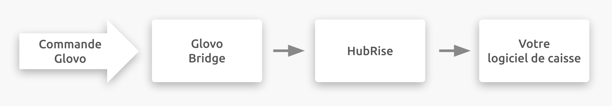

---

**REMARQUE IMPORTANTE :** La documentation complète est disponible <Link href="/apps/glovo">en anglais uniquement</Link>.

---

## Description

Glovo est une plateforme de commande et de livraison de repas en ligne destinée aux restaurants et aux commerces de proximité. Glovo offre également un service de livraison pour les pharmacies et d'autres types de biens. Ils visent à donner à tous accès à tout type de biens dans leur ville.

Glovo est basée à Barcelone en Espagne, mais l'entreprise est présente dans 25 pays en Europe, en Asie occidentale et en Afrique.

## Fonctionnalités de l'intégration

Connecter Glovo Bridge permet à HubRise de :

- Recevoir les commandes de Glovo, y compris le statut de commande.
- Recevoir les informations de livraison de Glovo, pour les commandes livrées par le restaurant.
- Envoyer un catalogue vers Glovo.
- Synchroniser l'inventaire avec HubRise.

Glovo Bridge peut être connecté à HubRise depuis le back-office de HubRise.

## Pourquoi se connecter ?

Le fait de connecter votre restaurant en ligne ou votre magasin de proximité Glovo à HubRise vous permet de recevoir vos commandes Glovo directement dans votre logiciel de caisse, sur votre système d'écran de cuisine ou dans votre système de gestion de livraison également connecté à HubRise. Vous pouvez ainsi gérer les commandes Glovo parallèlement à vos autres commandes, en utilisant vos outils habituels. Les commandes Glovo transiteront par votre installation existante, comme vos autres commandes.

Grâce à HubRise, vous pouvez synchroniser votre menu, vos informations clients et vos commandes avec votre logiciel de caisse, de commande en ligne, les plateformes de livraison de repas (dont Deliveroo, Uber Eats et Just Eat), les solutions de gestion de livreurs ou de services de livraison, les solutions eMarketing (SMS / eMailing), business intelligence, systèmes de gestion de stock et de fidélisation client, et bien d'autres encore. Le nombre d'applications compatibles augmente chaque mois. Pour voir les applications que vous pouvez connecter, consultez notre [page Apps](/apps).

## Prérequis

Pour permettre la connexion entre Glovo et HubRise, via Glovo Bridge, votre restaurant doit être partenaire de Glovo.
